# Магистерская диссертация

Тема: «Разработка системы детекции аномального сетевого трафика с использованием методов машинного обучения»

---

## Введение

Сетевой трафик — это один из немногих источников, где следы атак видны раньше, чем последствия в журналах приложений. При этом «аномалия» в сети редко выглядит как одиночный «красный флаг». Чаще это изменение динамики: вспышка интенсивности (burst), серия попыток соединения на множество портов (scan), либо атипичная статистика потока.

Сигнатурные IDS/IPS хорошо ловят известные паттерны. Но они зависят от актуальности правил и часто дают шум в нестабильной среде. Дальше влияет шифрование: полезная нагрузка не всегда доступна, и анализ неизбежно уходит в метаданные и поведение. В исследованиях по сетевой детекции это ограничение описывается как переход от анализа «содержимого» к анализу поведения: временных рядов, размеров пакетов, направлений, портов и устойчивых связей между узлами [1; 2].

Есть и прагматичная часть. Детекция полезна, только если она укладывается в ограничения по времени и ресурсам. Например, для прототипа фиксируются параметры сбора и агрегации (длительность, окно, частота записи), а также пороги, по которым формируется алерт. Это позволяет сравнивать варианты честно, а не «по ощущениям».

Цель работы — разработать прототип системы детекции аномального сетевого трафика, использующей методы машинного обучения и признаки потоков/окон, и оценить её качество на воспроизводимых сценариях.

Для достижения цели были поставлены и решены задачи, приведённые в Таблице 1.1.

Таблица 1.1 — Задачи исследования и ожидаемый результат

| Задача | Что требуется получить |
| Обзор подходов к детекции сетевых аномалий | Ограничения сигнатурных, статистических и ML-методов |
| Сравнение источников сетевых данных | Обоснование выбора пакетной телеметрии и Parquet-датасета |
| Формирование признакового пространства | Набор признаков потоков/окон без обязательного анализа полного payload |
| Реализация сбора и хранения | Повторяемый сбор с партиционированием по date/hour |
| Обучение модели и выбор порога | Получение anomaly score и правило перехода к алерту через contamination или квантиль |
| Определение метрик качества | Precision, recall, F1, ROC-AUC, PR-AUC, FPR, задержка и доля алертов |
| Описание архитектуры | Связь сбора, предобработки, ML-оценки, углубленной проверки и мониторинга |

Объект исследования — сетевой трафик в компьютерных сетях и процессы его мониторинга.

Предмет исследования — методы и программные средства детекции аномального сетевого трафика на основе статистических признаков и моделей машинного обучения, а также критерии качества таких систем (точность, задержка, устойчивость).

Научная новизна в рамках данной работы состоит в формализации задачи детекции для поточного трафика на уровне признаков потоков/окон и в привязке выбора модели к эксплуатационным ограничениям. Порог ложных срабатываний и задержка рассматриваются не как «второстепенные детали», а как требования, которые задают рамки всей системы.

Практическая значимость — в прототипе, который закрывает полный цикл: сбор пакетов, подготовку признаков, обучение/применение модели и базовый мониторинг. Ключевые параметры фиксируются конфигурацией (например, окно агрегации и пороги алертинга), а результаты сохраняются в виде артефактов (датасеты, модели, отчёты).

Методы исследования представлены в Таблице 1.2.

Таблица 1.2 — Методы исследования

| Метод | Назначение в работе |
| Системный анализ и проектирование | Описание архитектуры прототипа и границ модулей |
| Статистические методы | Формирование признаков: средние значения, дисперсии, межпакетные интервалы |
| Машинное обучение | Детекция без учителя на нормальном трафике и расчёт anomaly score |
| Экспериментальные методы | Синтетические сценарии, повторяемые прогоны, сравнение моделей |
| Оценка качества | Precision, recall, F1, ROC-AUC, PR-AUC, FPR, задержка, нагрузка и доля алертов |

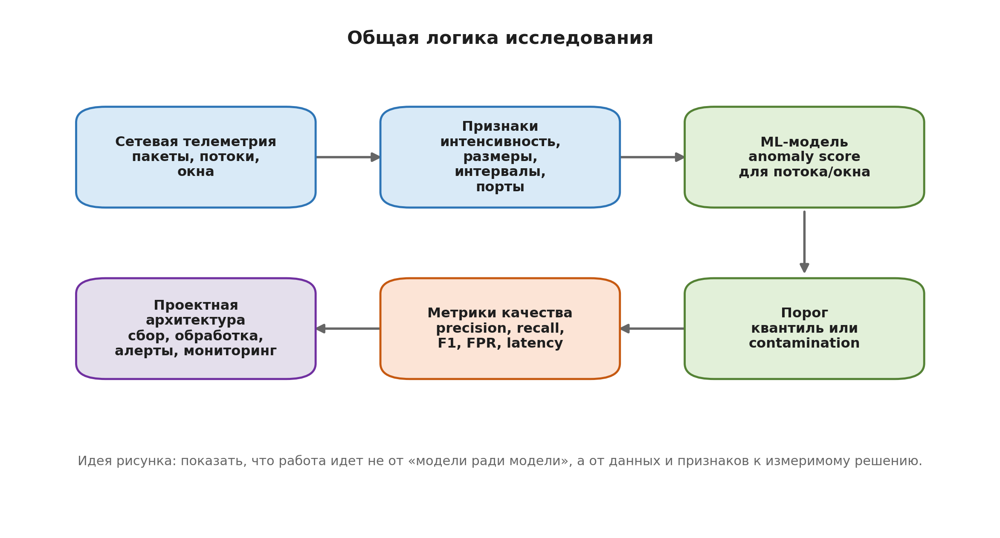

Рисунок 1.1 — Общая логика исследования: от сетевой телеметрии и признаков к модели, порогу, метрикам качества и проектной архитектуре.

## Глава 1. Аналитический и исследовательский раздел

В этой главе рассматриваются основные подходы к детекции аномалий в сети, анализируются источники данных, выбираются признаки и инструменты, а затем формулируются постановка задачи и критерии качества для разрабатываемой системы.

### 1.1 Современные методы детекции аномального сетевого трафика

Подходы к детекции удобно разделить на три класса: сигнатурные, статистические и методы машинного обучения. На практике в продуктах часто используется гибрид: правило «закрывает» известные атаки, а статистика/ML подхватывает неизвестные и слабосигнальные события. Такой вывод согласуется с обзорными работами по anomaly detection: один метод редко закрывает все типы отклонений, потому что сетевые аномалии отличаются по масштабу, длительности, частоте и степени известности [1].

Сигнатурные методы — это правила, описывающие известные паттерны: строка в payload, характерный заголовок, последовательность флагов, частота запросов к конкретному ресурсу. Плюс — высокая объяснимость: сработало правило, можно показать его оператору. Минус — ограниченная переносимость. Если атака меняет форму, сигнатура перестаёт работать. Второй минус — стоимость сопровождения: правила нужно обновлять, тестировать и согласовывать.

На уровне прототипа это важно как ориентир: сигнатуры дают «нижнюю границу» по задержке и объяснимости. Но они не закрывают сценарии, где атака выглядит как статистическое отклонение без устойчивого шаблона.

Статистические методы фиксируют отклонения от типичного поведения: всплески pps/bps, изменение распределения размеров пакетов, нестабильность межпакетных интервалов. Эти методы просты, иногда работают удивительно хорошо и обычно быстрые. Но у них есть слабое место: они чувствительны к смене режима работы сети. То, что было «аномалией» ночью, может стать нормой в рабочее время.

Чтобы статистика не превращалась в «генератор шума», ей нужны контекст и масштаб. Контекст — это сегмент и тип трафика. Масштаб — это окно агрегации: если окно слишком узкое, разброс естественно растёт.

Дальше идут методы машинного обучения. ML-подходы делятся на методы с учителем (когда есть разметка «норма/атака») и без учителя (когда производится обучение модели на нормальном трафике и выявляются отклонения). В реальных сетях разметка часто неполная или дорогая, поэтому детекция без учителя выглядит практичнее для прототипа: можно начать с небольшого набора признаков и получать оценку аномальности.

В данной работе безучительская постановка используется как базовая. Причина простая: если модель требует большого корпуса размеченных атак, то прототип становится зависимым от внешних датасетов и теряет связь с реальными условиями конкретной сети.

Отдельно отмечу ограничение, которое влияет на выбор методов: часто нельзя полагаться на payload. Во-первых, из-за шифрования. Во-вторых, из-за требований к приватности и хранению. Поэтому в работе упор делается на метаданные и агрегированные признаки.

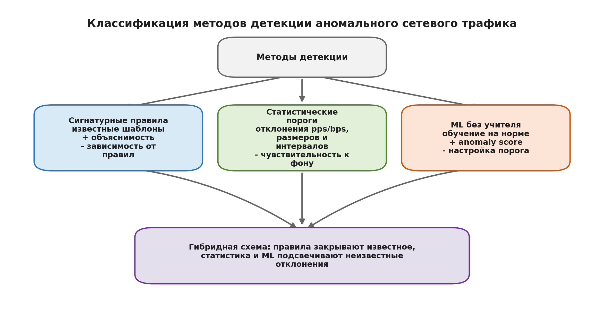

Рисунок 1.2 — Классификация методов детекции аномального сетевого трафика.

### 1.2 Обзор современных решений и аналогов

Чтобы корректно сформулировать задачу и требования, рассматриваются не отдельные «программы», а классы решений. У каждого класса своя сильная сторона и свой тип провала.

Сигнатурные IDS/IPS (например, Snort, Suricata) — зрелые решения, которые хорошо ловят известные атаки и дают объяснимые срабатывания. Они зависят от качества и актуальности правил. В нагруженных сегментах возникает компромисс: либо сокращать глубину анализа, либо принимать рост задержки.

Для сравнения с прототипом здесь важны два свойства: минимальная задержка при фиксированных правилах и «причина алерта», которую можно показать оператору (ссылка на правило, поле пакета, последовательность событий).

Системы сетевого мониторинга и анализа протоколов (например, Zeek) и DPI-подходы сильны в нормализации событий: они превращают поток пакетов в осмысленные логи и метрики по сессиям. Плюс — богатая телеметрия для последующего анализа. Минус — стоимость эксплуатации: нужно хранить много событий, а иногда и поддерживать сложные парсеры протоколов.

С практической точки зрения это часто «правильный первый шаг»: даже без ML сеть становится наблюдаемой. А уже на этой телеметрии проще строить аномалии и корреляции.

NDR/ML-платформы (коммерческий класс) обычно обещают детекцию «неизвестного» и удобство для SOC. На практике качество зависит от данных, а ещё от того, насколько прозрачно формируются алерты. Для данного исследования важен не бренд, а идеи: использование поведенческих моделей, корреляция событий, контроль дрейфа.

Если у алерта нет понятного объяснения (какие признаки «поехали» и насколько), оператор начинает игнорировать такие события. Поэтому в критериях отдельно выделяется интерпретируемость.

Для дальнейшего сравнения используется набор критериев, которые можно проверить на прототипе. Они сведены в Таблицу 1.3.

Таблица 1.3 — Критерии сравнения классов решений

| Критерий | Что проверяется | Значение для данного исследования |
| Входные данные | pcap, flow-экспорт, события приложений или хостовая телеметрия | Определяет, какие признаки можно получить без дополнительных источников |
| Задержка детекции | Время от появления события до алерта | Система бесполезна, если реагирует слишком поздно |
| FPR и recall | Доля ложных срабатываний и полнота обнаружения | Показывает баланс между пропусками и шумом для оператора |
| Объяснимость | Признаки, правила и контекст, доступные в алерте | Без объяснения событие трудно использовать в SOC |
| Инфраструктурная стоимость | Хранение, CPU/RAM, сложность развёртывания | Даже точная модель должна быть реализуема на доступных ресурсах |

Дополнительно фиксируется «технический долг» каждого класса решений. У сигнатур он обычно в правилах и обновлениях. У DPI — в сопровождении парсеров и в объёме событий. У ML — в контроле качества модели: пороги, дрейф, переобучение.

Чтобы этот раздел не оставался описательным, сравнение сведено в Таблицу 1.4. Она не претендует на «абсолютный рейтинг». Она показывает, какие компромиссы придётся принять.

Таблица 1.4 — Сравнение классов решений для детекции сетевых аномалий

| Класс решения | Что даёт быстро | Где чаще ломается | Что исследуется в работе |
| Сигнатурные IDS/IPS (Snort/Suricata) | Быстрые алерты по известным паттернам, понятная причина | Неизвестные и модифицированные атаки; рост правил → рост шума | Задержка, объяснимость, FPR на «чистом» фоне |
| Нормализация/аналитика (Zeek, DPI) | Богатая телеметрия по сессиям и протоколам | Стоимость хранения/обработки; сложность поддержки парсеров | Набор доступных признаков и стоимость их получения |
| ML/NDR | Детекция отклонений и корреляции | Непрозрачные алерты; дрейф; сложность настройки порогов | Как меняется доля алертов и качество при смене фона |

#### 1.2.1 Анализ аналогов разрабатываемого решения (коммерческие NDR-платформы)

Для сопоставления с прототипом полезно рассмотреть несколько распространённых коммерческих NDR‑платформ как примеры того, как в промышленной практике разделяются функции обнаружения, расследования и реакции. Важно подчеркнуть, что далее сравниваются не «бренды», а типовые принципы: построение базовой линии поведения, приоритизация сущностей и интеграция с контуром реагирования.

##### Darktrace (DETECT/RESPOND)

Darktrace обычно относят к классу NDR: платформа строит «картину нормального» поведения сети и затем подсвечивает отклонения, которые выбиваются из привычных паттернов конкретной инфраструктуры.

DETECT чаще воспринимается как слой выявления и приоритизации: формируются алерты, показываются связи участников сети, отмечаются странные изменения в частоте обращений, направлениях трафика, попытках доступа и типичности протоколов.

RESPOND позиционируется как автоматизация реакции: в зависимости от настроек и интеграций реакции могут быть «мягкими» (уведомления, тикеты, запуск плейбуков) или «жёсткими» (ограничение активности узла, блокировка/изоляция через внешние средства).

Достоинства: сильная сторона такого подхода — шанс заметить новые отклонения без заранее прописанной сигнатуры.

Ограничения: качество результатов зависит от полноты видимости трафика и аккуратности выделения периода «нормы»; при некорректной базовой линии возможны лишние срабатывания на легитимные всплески.

##### Vectra AI

Vectra AI также относится к NDR, но в описаниях и практике часто делается акцент на выявление атакующих сценариев в корпоративной сети, особенно когда злоумышленник уже находится внутри и пытается закрепиться, расширить доступ и двигаться «вбок» между хостами.

Обычно собирается сеть (сенсоры, потоки, телеметрия), после чего система пытается не просто сказать «аномально», а связать набор сигналов с более понятной картиной: подозрительные учётные активности, необычные связи между сегментами, странные обращения к сервисам, возможные признаки сканирования, подборов или командных каналов.

Достоинства: результатом обычно становится скоринг сущностей (хостов, аккаунтов) и приоритизация, чтобы внимание уходило на небольшое число наиболее «тяжёлых» эпизодов, а не на сотни разрозненных событий. Реакции, как правило, реализуются через интеграции с инфраструктурой безопасности и процессами SOC: блокировки, изоляции, автоматические задачи.

Ограничения: как и у других NDR, многое упирается в видимость восточно‑западного трафика и качество источников; если внутри сети мало данных, часть сценариев просто нечем подтверждать.

##### ExtraHop Reveal(x)

ExtraHop Reveal(x) часто описывают как сочетание сетевой видимости и NDR, где ценность — в подробной наблюдаемости сетевых взаимодействий и в возможности быстро провалиться от алерта к конкретным коммуникациям и транзакциям.

Платформа получает копию трафика (SPAN/TAP), извлекает метаданные и, насколько позволяет протокольный разбор, собирает контекст по приложениям: какие сервисы отвечают, где растут задержки, где увеличивается число ошибок, какие клиенты ведут себя нетипично.

На слое детекции появляются аномалии и правила/сигналы, а рядом — инструменты расследования: временные ряды, разрезы по хостам и сервисам, выделение «плохих» участков, возможность понять, это атака, сбой или перегрузка.

Достоинства: такой стиль работы полезен, когда важно не только «поймать подозрительное», но и быстро объяснить, что конкретно происходило в сети, особенно в прикладных протоколах.

Ограничения: чем больше трафика и чем выше требования к детализации, тем сложнее и дороже инфраструктурно становится развёртывание и сопровождение.

##### Cisco Secure Network Analytics (Stealthwatch)

Cisco Secure Network Analytics исторически тесно связан с анализом потоковой телеметрии (NetFlow/IPFIX и похожие источники) и поведенческим профилированием хостов на основе «кто с кем и как общается».

В типичном сценарии используется то, что уже умеют сетевые устройства: экспортировать данные о потоках, по которым можно понять направления, объёмы, частоты и «роли» узлов (клиент, сервер, промежуточный элемент), после чего платформа строит базовую линию и подсвечивает отклонения — неожиданные связи, аномальные объёмы, подозрительные внешние коммуникации, странную активность внутри сегментов.

Достоинства: такой подход хорошо масштабируется, потому что потоки легче обрабатывать и хранить, чем полный пакетный дамп, и часто покрывает большие сети без тотального зеркалирования.

Ограничения: глубины DPI и содержимого пакетов обычно меньше, поэтому некоторые тонкие признаки атак и специфические протокольные детали могут быть видны хуже без дополнительных источников. В экосистеме Cisco обычно ценятся интеграции и возможность связать сетевую аналитику с остальными компонентами защиты и управления инцидентами, чтобы события не оставались «в вакууме», а попадали в общий контур реагирования.

Отдельно для данного исследования полезно посмотреть на то, как эти классы представлены на российском рынке. Здесь важны два момента. Во‑первых, в отечественной практике «продукт» почти никогда не закрывает весь цикл от пакета до решения сам по себе: как правило, это связка источников телеметрии, движка корреляции/детекции и контура реагирования. Во‑вторых, рамки эксплуатации в российских организациях часто задаются не только техникой, но и процессом (ограничения на хранение payload, требования к журналированию, интеграция с действующим SOC).

Чтобы не превращать обзор в перечень торговых названий, в работе фиксируется карта классов решений и типичные «узлы» интеграции. На российском рынке (как по поставщикам продуктов, так и по практикам внедрения) чаще всего встречаются классы, указанные в Таблице 1.5.

Таблица 1.5 — Классы решений, влияющие на архитектуру прототипа

| Класс решений | Роль в инфраструктуре | Значение для данной работы |
| Периметровые и сегментные средства защиты (NGFW/UTM, IPS, WAF) | Быстрое блокирование и сигнатурная/эвристическая детекция на границе | Дают ориентир по задержке и объяснимости срабатывания |
| SIEM/SOAR | Сбор логов, нормализация, корреляция и оркестрация реакции | Требуют структурированного события со score, признаками и статусом |
| SOC как процесс или сервис | Анализ инцидентов, подтверждение алертов, контроль SLA | Задаёт требования к FPR, интерпретируемости и нагрузке на аналитиков |
| NTA/NDR и DPI | Поведенческие модели, статистика потоков, протокольный анализ | Ближайший класс аналогов для проектируемого прототипа |
| DLP и контроль утечек | Контроль содержимого и политики передачи данных | Подсвечивают ограничение: полный payload не всегда допустимо хранить |

В качестве ориентиров присутствия на рынке можно назвать российские продуктовые линейки и вендоров, которые часто фигурируют в внедрениях: Positive Technologies (в том числе SIEM и сетевые средства обнаружения), «Ростелеком‑Солар» (SOC/мониторинг и экосистема средств), BI.ZONE (SOC/сервисы и TI‑компоненты), «Лаборатория Касперского» (платформы детекции/защиты и сенсоры), Group‑IB (TI и решения для расследования/детекции), а также экосистемы вокруг NGFW (например, UserGate) и отечественных средств сетевой инфраструктуры. Здесь намеренно не делается «рейтинг» и не делается привязка к конкретным версиям: для данного исследования важнее типовые принципы работы, чем название коробки.

Сравнение с прототипом в этой работе строится по тем критериям, которые реально измеримы и совпадают с практикой эксплуатации. Ниже, в Таблице 1.6, приведена краткая аналитическая сводка «что важно» для разных классов решений и как это связано с разрабатываемым прототипом.

Таблица 1.6 — Сопоставление классов решений с архитектурой разрабатываемого прототипа

| Класс решения | Что обычно является входом | Где возникают ограничения | Как это отражается в прототипе |
| NGFW/IPS/WAF | Пакеты/сессии на периметре, сигнатуры и эвристики | Сильная зависимость от правил; шифрование; нагрузка на линию | Рассматривается как нижняя граница по задержке и как пример объяснимого алерта (правило/поле) |
| SIEM/SOAR | Логи и события из разных источников | Качество нормализации и корреляции; сложность поддержания правил | Прототип формирует воспроизводимые события (окна/потоки) и даёт score/порог, который можно использовать в корреляции |
| SOC (процесс) | Инциденты из средств защиты + контекст | Усталость от алертов при высокой FPR; требования к объяснимости | Метрики FPR/latency/доля алертов фиксируются как требования к модели и порогу |
| NDR/DPI | Сетевая телеметрия + поведенческие признаки | Дрейф фона; трудность интерпретации; стоимость данных | В прототипе используются компактные признаки и простой порог (quantile/contamination) с явной привязкой к риску |

Практический вывод из обзора российского рынка для данной работы состоит в следующем: ценность прототипа в том, что он из сетевых событий строит воспроизводимое и измеримое представление (вектор признаков, score, порог, метрики), а это и есть то, что затем интегрируется в промышленный контур — будь то корреляция в SIEM, SOC‑процессы или NDR‑аналитика. Поэтому дальше делается акцент на данных, признаках и критериях качества, а не на «сложности» модели.

Далее будут уточнены несколько особенностей, которые типичны именно для российских внедрений и которые напрямую влияют на постановку задачи в данном исследовании.

Во многих организациях критична изоляция и «закрытость» контура: часть инфраструктуры физически или организационно не связана с внешними сетями, обновления и интеграции проходят через регламент, а некоторые источники телеметрии невозможно отправлять в облачные сервисы. Это приводит к практическому требованию: метод детекции должен быть реализуемым локально, а все входные данные и артефакты обучения должны храниться в пределах периметра.

Другая особенность — неоднородность парка средств защиты. На одном предприятии могут одновременно использоваться несколько семейств сетевого оборудования и несколько систем логирования. Поэтому на практике ценится не «идеальная модель», а ясный контракт на вход/выход: какие поля нужны для признаков, какой формат события отдаёт детектор, как интерпретируется score, как фиксируется правило выбора порога. Именно это делает прототип переносимым: он описывает, что такое «аномалия» на уровне измеряемых величин.

Отдельно стоит вопрос объяснимости. В промышленном SOC алерт без причины малоценен: оператор должен быстро понять, что стало триггером (всплеск интенсивности, необычный портовый профиль, изменение длительности потоков). Поэтому даже при использовании AutoEncoder рассматривается интерпретация как часть эксперимента: модель выдаёт score, а рядом должны быть признаки и простые статистики, которые объясняют, почему score вырос. В прототипе это реализуется на уровне отчётности: вместе со score сохраняются исходные признаки, что позволяет показать их динамику по времени.

Наконец, в российских условиях часто сильнее выражены организационные требования к журналированию и контролю жизненного цикла. Как практический принцип это означает: результаты эксперимента должны быть воспроизводимы, а условия эксперимента — зафиксированы.

С этой точки зрения, при выборе подхода к детекции в сети можно выделить критерии, которые одинаково релевантны как для данного исследования, так и для практики. Они представлены в Таблице 1.7.

Таблица 1.7 — Практические критерии выбора подхода к детекции

| Критерий | Содержание | Связь с прототипом |
| Наблюдаемость и измеримость | Нужно объективно измерять задержку, пропускную способность и долю алертов | Эти показатели включаются в мониторинг и критерии качества |
| Совместимость с шифрованием | Предпочтительны признаки по метаданным, а не по содержимому | Базовый вектор строится без полного payload |
| Стоимость получения признаков | Сложный протокольный парсинг повышает стоимость сопровождения | Сначала используются простые L3-L4 и статистические признаки |
| Контроль ложных срабатываний | SOC должен получать ограниченное число проверяемых алертов | Порог задаётся через contamination или квантиль score |
| Переносимость и воспроизводимость | Метод должен работать на другом интервале и проверяться повторно | Фиксируются конфигурация, данные, scaler, модель и порог |

Если связать эти критерии с разрабатываемым прототипом, получается понятная роль в целевой архитектуре. Прототип — это не «замена NGFW или SIEM», а модуль, который из потока телеметрии строит признаки, вычисляет score аномальности, переводит его в статус через воспроизводимый порог и сохраняет контекст для последующей корреляции. Во второй главе эта роль разворачивается в архитектуру с тремя статусами: регулярный, подозрительный и вредоносный.

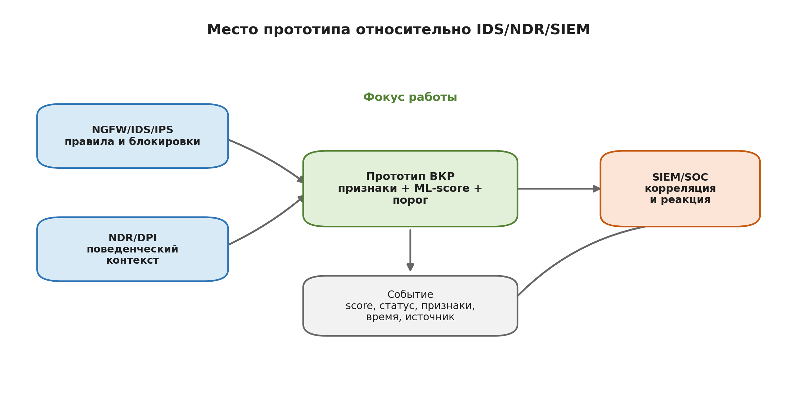

Рисунок 1.3 — Место прототипа относительно NGFW/IDS, NDR и SIEM в контуре обнаружения и корреляции событий.

Такое позиционирование принципиально важно для корректного сравнения подходов. Если сравнивать «коробочные продукты» по маркетинговым описаниям, вывод будет спорным. Если сравнивать по измеримым параметрам (вход, метрики, порог, доля алертов, задержка), то сравнение становится инженерным и воспроизводимым.

### 1.3 Источники сетевых данных и способы съёма трафика

Системе детекции нужен стабильный источник данных. Для сети чаще всего рассматривают несколько вариантов, отличающихся уровнем детализации и стоимостью обработки.

SPAN/Port Mirroring — это зеркалирование трафика на порт анализатора. Решение простое и широко доступное, но у него есть типичная проблема: при высокой нагрузке возможны потери, а значит и «дырки» в данных. Кроме того, нужно учитывать топологию: зеркалирование одного сегмента не даёт полной картины.

NetFlow/sFlow — потоковые записи, которые уже агрегированы устройством сети. Плюс — низкая нагрузка и удобство хранения. Минус — потеря деталей: не видно последовательностей пакетов и некоторых полей, которые полезны для тонкой детекции.

На практике между «сырыми пакетами» и NetFlow часто есть промежуточный слой — нормализованная сессионная телеметрия. Примером служат журналы сетевых средств (NGFW/IPS), а также анализаторы, которые строят сессии и протоколы (например, подходы класса Zeek/DPI). Такие источники дают богатую семантику (HTTP‑поля, SNI, JA3/JA4‑подобные отпечатки, метки протоколов), но они зависят от конкретного парсера и политики журналирования. Для данного исследования это означает, что сравнение методов становится «несимметричным»: часть признаков появляется только там, где есть конкретный разбор L7.

Ещё один класс источников — хостовая телеметрия (события ОС, EDR‑агенты, трассировка сокетов). Она часто даёт контекст, которого нет в сети (идентификаторы процессов, пользователей, бинарников), но при этом сильно зависит от парка ОС и политики установки агентов. В рамках данной работы хостовая телеметрия сознательно оставляется за пределами экспериментов, чтобы фокус оставался на сетевом уровне и на признаках, доступных без внедрения агентов.

Таким образом, выбор источника — это баланс между универсальностью и информативностью. В рамках данного исследования выбран наиболее универсальный вариант (пакетная телеметрия), а информативность добирается за счёт контролируемого построения признаков и агрегаций. Это позволяет сохранять совместимость с шифрованным трафиком и не зависеть от особенностей конкретной «коробки».

pcap (и производные датасеты по пакетам) — наиболее «сырой» и информативный источник: можно извлекать любые метаданные и строить свои признаки. Недостаток — цена обработки и хранения. Поэтому на практике pcap часто превращают в структурированный датасет и дальше работают с ним.

В рамках прототипа выбран путь пакетной телеметрии с захватом через Scapy (на Windows — через Npcap), после чего данные приводятся к удобному формату: записи по пакетам сохраняются в Parquet и партиционируются по date/hour. Формат pcap при этом остаётся полезным как универсальный «контейнер» для обмена и тестового воспроизведения (реплея), но для повторяемых прогонов и аналитики удобнее работать с колонночным датасетом.

Ещё один плюс такого подхода — контроль над признаками. В таком варианте нет зависимости от того, какие поля экспортирует конкретное сетевое устройство. Если возникает необходимость добавить новый признак (например, частоту смены портов у источника), это можно сделать на уровне предобработки и повторить эксперимент на тех же исходных данных.

Минусы также фиксируются заранее. Во время съёма трафика могут быть потери пакетов. На Windows обычно нужны повышенные права и корректно установленный драйвер захвата. Поэтому в прототипе сбор отделён от анализа, а запись выполняется батчами: это снижает риск, что диск или обработка начнут «душить» захват.

С инженерной точки зрения важнее всего то, что датасет получается «жизнеспособным» для повторяемых экспериментов. Партиционирование по date/hour даёт естественную гранулярность: можно брать один час как минимальную единицу анализа, а можно объединять несколько часов в более крупный интервал. При этом обработка масштабируется по данным: если проводится эксперимент с признаками, не требуется пересчитывать всё сразу, достаточно ограничиться партициями, на которых проводится сравнение.

Состав сохраняемой записи подбирается таким образом, чтобы из неё можно было построить как базовые признаки интенсивности (размеры/интервалы), так и признаки структуры (порты, направление, TCP‑флаги). При этом исключается хранение полного payload. Вместо этого допустим укороченный отпечаток (например, первые байты в виде hex‑строки) или полное исключение payload из датасета — это делает подход применимым в условиях, где хранение содержимого запрещено политикой безопасности.

Отдельно отмечается, что «качество» телеметрии само является фактором качества детекции. Если при высокой нагрузке появляются дропы, то статистика интервалов и интенсивности может исказиться так, что модель начнёт срабатывать на артефакты захвата. Поэтому корректный прототип должен уметь хотя бы диагностировать подобные ситуации: фиксировать скорость записи, размер очередей, задержки батчевой записи, а при необходимости — сигнализировать, что часть данных потеряна.

Наконец, вопрос времени. Для сетевого трафика типична проблема рассинхронизации: метки времени могут быть неточными из‑за особенностей драйвера захвата или нагрузки на систему. В прототипе проводится нормализация временных меток и хранение их в едином формате, чтобы корректно собирать окна и сопоставлять эксперименты. Это важно и для качества модели, и для интерпретации результатов (например, когда нужно показать оператору, в какое время произошёл всплеск).

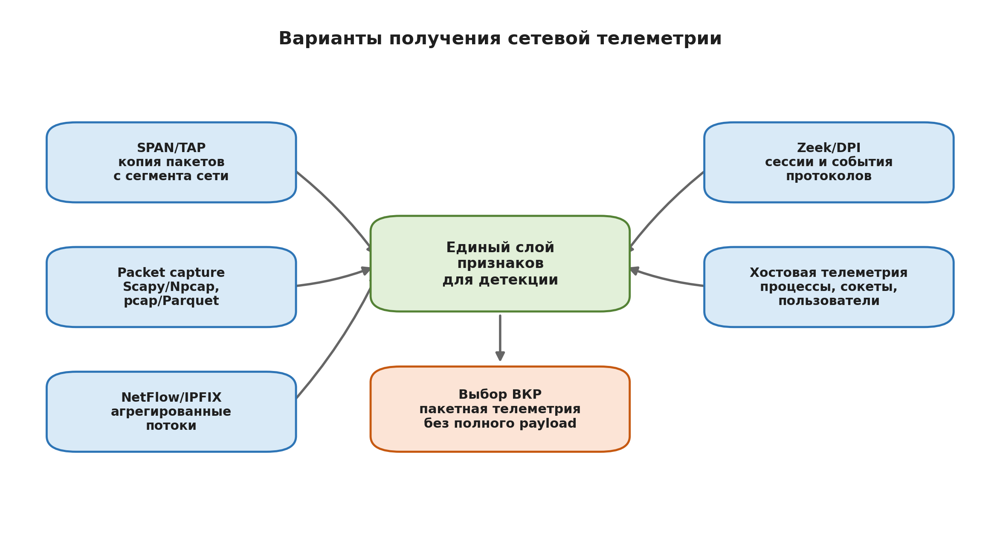

Рисунок 1.4 — Варианты получения сетевой телеметрии для задач детекции аномалий.

### 1.4 Анализ признаков сетевых потоков

Качество детекции в большой степени определяется тем, что именно считать «наблюдением». Есть три базовых уровня агрегации. Они представлены в Таблице 1.8.

Таблица 1.8 — Уровни агрегации сетевого трафика

| Уровень | Единица наблюдения | Что даёт | Ограничение |
| Пакетный | Отдельный пакет | Максимальная детализация: размер, протокол, порты, флаги | Слишком много событий и высокий шум |
| Потоковый | flow_key или 5-ка адресов/портов/протокола | Устойчивые статистики за время обмена | Нужно корректно задавать направление и таймауты |
| Оконный | Фиксированное время или число событий | Динамика поведения за интервал | Выбор окна влияет на задержку и чувствительность |

В реальных сетях эти уровни часто комбинируются. Пакетный уровень даёт максимальную детальность, но с ним сложно напрямую работать в модели: слишком много событий, а распределения по полям тяжёлые. Потоковый уровень удобен тем, что нормализует «шум» на уровне сессий: вместо десятков тысяч пакетов мы получаем несколько тысяч потоков со статистиками. Оконный уровень полезен тогда, когда нас интересует именно динамика по времени (например, рост числа уникальных портов у источника за 10 секунд), даже если отдельные потоки очень короткие.

Отдельный вопрос — что считать «потоком». В классической сетевой аналитике поток определяется 5‑кой (src/dst IP, src/dst port, протокол), но возможны варианты: однонаправленный поток, двунаправленное объединение прямого и обратного направления, а также поток с таймаутом неактивности. В данном исследовании важно не столько выбрать «единственно правильный» вариант, сколько зафиксировать его и применять одинаково во всех экспериментах.

Иначе признаки будут несопоставимы: например, двунаправленное объединение меняет распределение интервалов и размеров, а таймауты меняют длительности. В прототипе архитектура исходит из простой и воспроизводимой схемы: базовая агрегация строится вокруг flow_key, а усложнения (объединение направлений, оконные агрегаты) рассматриваются как расширение.

Также в сетевых данных есть практические эффекты, которые влияют на признаки и качество детекции. Они сведены в Таблицу 1.9.

Таблица 1.9 — Практические эффекты, влияющие на признаки

| Эффект | Как проявляется | Что требуется от предобработки |
| NAT и динамические порты | Много коротких потоков с эфемерными портами источника | Не трактовать рост числа потоков как атаку без контекста сегмента |
| Фоновые сервисы | Легитимные всплески из-за обновлений, резервного копирования, телеметрии | Контролировать FPR на чистом фоне и учитывать время/сегмент |
| Пограничные случаи агрегации | Потоки из 1-2 пакетов, нулевая длительность, пустые интервалы | Избегать NaN/inf, задавать безопасные значения и логировать долю таких случаев |

Выбор длины окна — ещё одна важная настройка. Слишком короткое окно даёт шумную оценку pps/bps и «дёрганые» признаки, слишком длинное — сглаживает аномалию и увеличивает задержку обнаружения. В текущей конфигурации прототипа параметр window_size=100 задаёт базовый размер окна по числу наблюдений. Временные окна 1-10 секунд можно рассматривать как расширение эксперимента, но в первой версии важно зафиксировать один режим и применять его одинаково.

Для прототипа используется компактный, но не минималистичный набор агрегированных признаков, достаточный для сценариев burst/scan и похожих отклонений. Он согласован с предобработкой в main_pipeline.py и с архитектурой второй главы.

Таблица 1.10 — Базовые признаки прототипа

| Признак | Смысл | Зачем нужен |
| packet_count | Число пакетов в потоке/фрейме | Оценка масштаба обмена |
| duration | Длительность наблюдения | Нормировка интенсивности и отделение коротких попыток |
| total_bytes | Суммарный объём байт | Фиксация объёмных всплесков |
| avg_packet_size, std_packet_size | Средний размер и разброс | Описание распределения размеров |
| min_packet_size, max_packet_size | Границы размеров | Выявление крайних и нетипичных значений |
| pps, bps | Пакеты/байты в секунду | Детекция burst и DoS-подобных режимов |
| avg_inter_arrival, std_inter_arrival | Средний интервал и разброс | Анализ ритма обмена и автоматизированных попыток |
| src_port, dst_port, protocol | Транспортный контекст | Уточнение структуры соединений и scan-сценариев |

Эти признаки не требуют доступа к содержимому пакетов и потому применимы и к шифрованному трафику. При этом они не «магические»: если вырос pps и одновременно увеличилась дисперсия интервалов, это легко интерпретировать как всплеск активности или нестабильное поведение источника.

Почему выбран именно такой компактный набор? Он покрывает базовые проявления аномалий в сценариях, на которых проверяется прототип, и при этом остаётся интерпретируемым. Burst обычно проявляется как сдвиг масштаба: резко растёт интенсивность и/или изменяется распределение размеров пакетов. Это почти напрямую отражается в pps, bps, total_bytes, avg_packet_size и max_packet_size. Scan‑сценарий сложнее: его сигнал часто скрыт не в общем росте трафика, а в структуре попыток соединения и высокой изменчивости. Поэтому для scan базовый набор признаков является стартовой точкой, а не финальной границей модели.

Чтобы сделать детекцию scan‑подобных событий устойчивее, логично добавлять признаки структуры обращений, которые вычисляются из тех же метаданных без полного payload. К таким признакам относятся число уникальных портов назначения для одного источника за окно, доля SYN‑пакетов, доля коротких потоков и энтропия портов или адресов назначения. Эти признаки полезны не потому, что «сложнее», а потому что они ближе к природе сканирования: сканирование — это комбинаторная активность, а не только рост скорости.

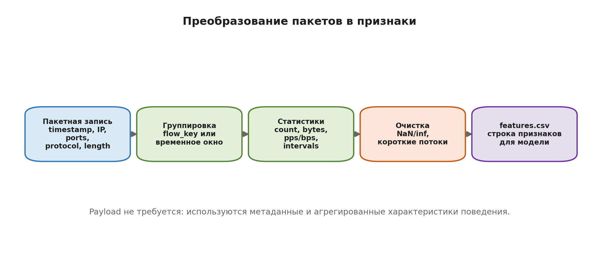

Рисунок 1.5 — Преобразование пакетных записей в агрегированные признаки для модели детекции.

Дальше производится разделение двух понятий: «полезные признаки» и «избыточные». Полезные — те, что отвечают на вопрос, почему окно стало аномальным. Избыточные — те, что увеличивают размерность без явного выигрыша в качестве.

В прототипе признаки агрегируются по ключу потока (flow key), а затем сохраняются в таблицу. Это удобно: можно обучать модель не на отдельных пакетах, а на более устойчивых наблюдениях, где шум сглажен.

Технически это выглядит так: из пакетных записей события группируются по flow_key и вычисляются статистики (число пакетов, длительность, суммарный объём, средние и дисперсии). Дальше для модели берется небольшой поднабор, чтобы не разгонять размерность без необходимости.

С точки зрения методики это выбор компромисса между двумя рисками. Если признаков слишком мало, модель становится «слепой» к части угроз и реагирует только на грубые всплески. Если признаков слишком много, прототип теряет интерпретируемость, растёт риск подгонки под конкретный фон и усложняется контроль дрейфа. Поэтому расширение признаков как управляемый эксперимент: каждый новый признак должен давать измеримый прирост качества или снижение FPR, иначе он не оправдан.

Итак, признаки должны отвечать на вопрос «что произошло с потоком» через измеримые величины. Для burst вектор обычно растёт по pps, bps и среднему размеру. Для scan сильнее меняется структура попыток соединения и частота смены портов, поэтому этот класс аномалий логично поддерживать дополнительными признаками на источнике.

Дальше набор можно расширять, если цель — детекция более сложных классов угроз. Например, добавлять энтропию полезной нагрузки (когда она доступна), статистику TCP-флагов, асимметрию направлений потока, длительность сессии, число уникальных портов на источнике за окно. Во второй главе эти признаки разделяются на быстрый слой и слой углубленной проверки: базовая модель работает на компактном векторе, а DPI/nDPI и правиловый анализ подключаются только для подозрительных фреймов.

Ещё один практический аспект — нормализация и устойчивость к выбросам. Даже «простые» признаки вроде pps и bps имеют тяжёлые хвосты распределения и сильно зависят от сегмента сети. Поэтому в прототипе явно отделен этап масштабирования (скейлинг) от модели детекции: скейлер сохраняется как артефакт вместе с моделью. Это важно не только для качества, но и для корректности применения модели на новом прогоне.

Наконец, вопрос окна и потока. В тексте используется формулировка «потоки/окна», потому что в реальных системах часто используется гибрид: часть признаков считается по потоку (5‑ка), часть — по фиксированному окну времени (например, 1–10 секунд). В прототипе базовая агрегация строится вокруг flow_key, но архитектурно ничто не мешает добавить оконные агрегаты поверх тех же данных.

### 1.5 Обзор инструментов и библиотек для реализации

Инструменты в этой работе выбираются не «по популярности», а под конкретную задачу: быстро собрать датасет, воспроизвести эксперимент и сравнить методы.

Чтобы показать соответствие текста реализации, кратко фиксируется, как устроен прототип в репозитории и какие роли выполняют его части. Это важно, потому что в прикладных работах на качество результата влияет не только модель, но и инженерная цепочка: где и как снимается телеметрия, как она хранится, как строятся признаки, как сохраняются артефакты и как затем повторяется эксперимент.

В рамках проекта можно выделить несколько логических модулей. Их соответствие архитектуре показано в Таблице 1.11.

Таблица 1.11 — Логические модули проекта и их роль

| Модуль | Где отражён в проекте | Роль в исследовании |
| Сбор сетевой телеметрии | Packet-Real-Time-Collector/src/main.py, Scapy/Npcap, Parquet | Захват пакетов и запись метаданных с партиционированием по date/hour |
| Генерация синтетических сценариев | synthetic_generator.py | Воспроизводимые проверки burst и scan |
| Предобработка и признаки | main_pipeline.py, detection_core.py, pipeline_config.yaml, data/processed/features.csv | Группировка по flow_key, расчёт статистик, нормализация и сохранение таблицы признаков |
| ML-модуль | detection_core.py (ансамбль IForest + AutoEncoder из PyOD), артефакты в models/ | Обучение без учителя и получение anomaly score |
| Углубленная проверка | detection_core.py (функция deep_inspection), правила в decide_status | Сигнатурные правила второго уровня для присвоения финального статуса |
| Наблюдаемость | monitoring_system.py, prometheus-client, pipeline_config.yaml | Сбор latency, доли алертов, метрик обработки и качества через Prometheus |

Если собрать это в один сквозной поток данных, получается цепочка: захват пакетов, запись пакетных метаданных в Parquet, выбор диапазона времени для эксперимента, построение признаков, обучение детектора, инференс, выбор порога, формирование алертов и расчёт метрик. Именно эта цепочка затем формализуется во второй главе как целевая архитектура с отдельными модулями сбора, предобработки, ML-оценки, углубленной проверки и наблюдаемости.

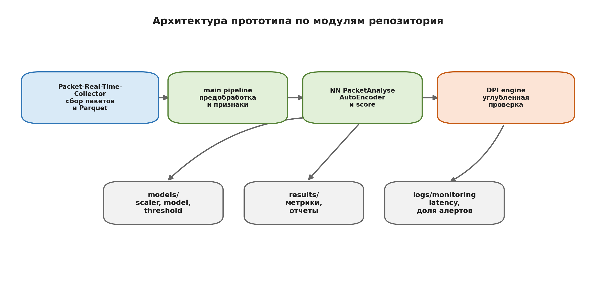

Рисунок 1.6 — Архитектура прототипа по модулям репозитория и основным артефактам эксперимента.

Такое представление полезно тем, что оно делает точку отказа явной. Например, если доля алертов выросла, я могу последовательно проверить: не изменился ли фон, не появились ли потери пакетов, не поменялась ли агрегация признаков, не сместился ли скейлер, не изменился ли порог. В противном случае исследование превращается в «чёрный ящик», где невозможно объяснить, почему результат получился именно таким.

Отдельно отмечу вопрос параметризации. В прототипе я стараюсь выносить управляемые параметры (окно агрегации, список признаков, способ порога) в конфигурацию. Это важно по двум причинам. Во‑первых, это делает сравнение методов корректным: если меняется только один параметр, можно привязать изменение качества к этому параметру. Во‑вторых, это приближает работу к эксплуатации: в реальном SOC/инфраструктуре такие параметры должны быть управляемыми и документированными, а не «зашитыми» в код.

Для захвата трафика используется Scapy (на Windows — с Npcap). Для хранения выбирается Parquet через PyArrow: это колонночный формат, удобный для последующей аналитики, и он позволяет партиционировать данные по времени. Для обработки применяются Pandas/NumPy.

С практической точки зрения этот стек закрывает два режима работы, которые важны для данной работы. Первый — режим «сбора»: нужно надёжно и предсказуемо записывать телеметрию и не мешать захвату тяжёлой обработкой. Второй — режим «аналитики»: нужно быстро читать датасет, агрегировать признаки, тренировать модель, строить графики и метрики. Разделение по этапам позволяет держать систему устойчивой: при перегрузке аналитики сбор не должен деградировать в первую очередь.

Сознательно отделяются «сырые пакеты» от «признаков». Пакеты пишутся батчами, чтобы не упираться в дисковую подсистему. Дальше признаки можно пересчитать заново, не трогая этап захвата.

Отдельно отмечу, что такой разнос упрощает проверку гипотез. Если изменился набор признаков или способ агрегации, мне не нужно переснимать трафик. Просто пересчитывается таблицу признаков из того же Parquet.

Для прототипа детекции без учителя используется PyOD и модель AutoEncoder. Плюс такого выбора — быстрый старт и понятный интерфейс для получения anomaly score. Масштабирование и более строгие эксперименты можно строить на scikit-learn (например, Isolation Forest) или на собственных моделях, если потребуется.

Выбор PyOD также удобен методически: библиотека объединяет несколько алгоритмов обнаружения выбросов в едином интерфейсе, поэтому можно сравнивать AutoEncoder, Isolation Forest и другие модели на одном наборе признаков [3]. Это снижает риск, что различие результатов связано не с моделью, а с разной подготовкой данных.

Важно подчеркнуть, что AutoEncoder в PyOD возвращает не «класс атаки», а скалярную оценку аномальности (decision score), которая затем переводится в бинарный флаг через порог. Это согласуется с эксплуатационной логикой: решение о пороге зависит от допустимого риска ложных срабатываний и может быть разным для разных сегментов сети.

Важная инженерная деталь — порог. В простой версии я использую квантиль по score (например, $q=0.99$) или ожидаемую долю аномалий (contamination). Это честно отражает реальность: порог — это управление риском, а не «магическое число».

Ещё одна деталь — артефакты обучения. В прототипе модель и скейлер сохраняются в виде файлов (joblib). Это позволяет разделить обучение и применение: можно обучить модель один раз, а затем прогонять детекцию на разных наборах данных и сравнивать распределение score.

Акцент сделан на артефактах, потому что это «точка честности» эксперимента. Если скейлер и модель не сохраняются вместе, то результат легко случайно исказить: другая нормализация даст другое распределение score и, соответственно, другой порог. В прототипе артефакты лежат в каталоге models/, а параметры эксперимента фиксируются конфигурацией. Это минимальная версия воспроизводимости, достаточная для данной работы.

Отдельно важно логирование. Для сравнения методов нужно сохранять не только итоговые метрики, но и контекст: какие партиции данных использовались, какие признаки включены, какой порог применён, сколько окон/потоков помечено как аномалии. Это помогает корректно интерпретировать результаты и снижает риск «подгонки» модели задним числом.

Для эксплуатационного контура естественно рассматривать Prometheus/Grafana: это стандартный стек для метрик и алертинга. В контексте данной работы важно не «поднять красивый дашборд», а определить набор измеримых параметров: доля аномалий в потоке, задержка обработки, ресурсы, стабильность модели.

Здесь делается оговорка, чтобы не было расхождений с прототипом: в кодовой базе присутствуют компоненты для сбора/экспорта метрик и базового алертинга, но в рамках первой главы это рассматривается прежде всего как целевая архитектура наблюдаемости и набор требований. Для данной работы важно, чтобы требования к метрикам были сформулированы до эксперимента: иначе «плохую» модель легко оправдать тем, что она просто не была измерена.

Если система раз в час начинает флагать 30% окон как аномальные, то это событие само по себе. Причина может быть и в атаке, и в дрейфе, и в ошибке сбора данных. Поэтому метрики наблюдаемости рассматриваются как часть постановки задачи.

Минимальный набор метрик для прототипа  такой: скорость обработки (записей/сек), задержка расчёта признаков и инференса, доля помеченных окон/потоков, а также базовые ресурсы (CPU/RAM). Этого достаточно, чтобы поймать «слом» ещё до анализа качества по меткам.

Итак, выбранный стек покрывает весь цикл: от пакетов до метрик качества. При этом он остаётся достаточно простым, чтобы его можно было воспроизвести и проверить.

### 1.6 Постановка задачи и критерии качества

В работе рассматривается следующая постановка задачи. На вход подаётся поток сетевых событий (пакеты или агрегированные представления), из которого формируется последовательность векторов признаков по потокам или по временным окнам. Модель детекции вычисляет оценку аномальности и принимает решение об обнаружении аномалии на основе заданного порога.

Порог задаётся либо через ожидаемую долю аномалий (параметр contamination), либо через квантиль распределения числовых оценок (например, для выделения верхнего 1% наиболее «подозрительных» окон или потоков). Это простой механизм, но он честно отражает реальную проблему: порог нельзя считать раз и навсегда заданным, его нужно привязывать к выбранному риску ложных срабатываний.

Важная методическая деталь: порог — это не только про математику, но и про стоимость ошибок. В сетевой детекции ложноположительный алерт обычно дороже, чем «пропущенная» слабая аномалия, потому что ложные срабатывания быстро приводят к усталости оператора и деградации процесса реагирования. Поэтому в критериях качества отдельно выделяются FPR и доля алертов как эксплуатационные параметры, а порог выбирается так, чтобы контролировать именно этот риск.

Для данной работы важно, чтобы выбор порога был воспроизводим. Поэтому фиксируется правило выбора порога в конфигурации и применяется одинаково во всех экспериментах. Иначе сравнение методов становится нечестным: один метод «подкручивается» сильнее другого.

Кроме того, разделяются выбор порога и оценка качества. Порог корректно выбирать на тренировочном или валидационном наборе, а метрики считать на отложенном тесте. Даже в синтетическом эксперименте это важно: иначе происходит фактический подбор порога «по ответам».

Для сетевых данных дополнительно фиксируется правило разбиения по времени. Если случайно перемешать окна/потоки из одного и того же временного интервала между train и test, оценки качества могут оказаться завышенными, потому что фон «одинаков», а модель по сути проверяется на почти тех же режимах. Поэтому более корректно делать отложенный тест как более поздний временной интервал или как отдельный прогон (например, другой день/час).

Критерии качества делятся на две группы: метрики точности детекции и эксплуатационные показатели. Они представлены в таблицах 1.12 и 1.13.

| Метрика | Что измеряет | Почему используется |
| Recall | Долю обнаруженных аномалий среди всех аномалий в тесте | Показывает риск пропуска события |
| Precision | Долю корректных срабатываний среди всех срабатываний | Показывает уровень шума для оператора |
| F1 | Баланс precision и recall | Удобна при сравнении методов на одном пороге |
| ROC-AUC | Качество ранжирования по score при разных порогах | Позволяет оценить модель до выбора конкретного порога |
| PR-AUC | Качество ранжирования при редком классе аномалий | Полезна при сильном дисбалансе |
| FPR | Доля ложноположительных срабатываний | Ключевой эксплуатационный риск |

Таблица 1.12 — Метрики точности детекции

Таблица 1.13 — Эксплуатационные критерии

| Критерий | Что измеряется | Ориентир для прототипа |
| Задержка | Время обработки окна/потока | Порядка <= 1000 мс на цикл обработки |
| Пропускная способность | Сколько событий/потоков обрабатывается за секунду | Должна быть достаточной для выбранного сегмента |
| Ресурсы | CPU, память, нагрузка на диск | Не должны мешать сбору телеметрии |
| Устойчивость к дрейфу | Изменение доли алертов и распределения score при смене фона | Резкий сдвиг требует проверки порога, признаков или переобучения |

Под устойчивостью к дрейфу понимается измеримая стабильность. Если модель обучена на норме, то при смене фона (другая нагрузка, другой сегмент, другой тип легитимного трафика) распределение score и доля срабатываний не должны «улетать» без причины. В прототипе это проверяется простым способом: фиксированный порог применяется на нескольких прогонах, и сравниваются доли алертов и базовые статистики score. Если наблюдается резкий сдвиг, это сигнал, что нужно пересматривать признаки, окно, порог или стратегию переобучения.

Чтобы критерии качества были не декларацией, а измеримой методикой, уточняется, как именно считаются метрики в выбранных сценариях.

Во‑первых, разметка синтетических аномалий. В сценариях burst/scan момент начала и длительность задаются параметрами генерации, поэтому «истина» известна на уровне времени. Однако модель работает не с непрерывным временем, а с окнами или потоками. Поэтому определяется правило, по которому окно помечается как аномальное. Самый простой и воспроизводимый вариант — метка по пересечению интервалов: окно считается аномальным, если оно пересекается с интервалом атаки по времени. Более строгий вариант — требовать минимальную долю пересечения (например, окно считается аномальным, если не менее половины окна приходится на интервал атаки). Выбор правила влияет на метрики: слишком мягкое правило завышает recall, слишком жёсткое может наказать метод за «переходные» окна.

Во‑вторых, задержка обнаружения. Для алертинга важен не только факт обнаружения, но и насколько быстро он происходит. Поэтому дополнительно можно измерять задержку как разницу между временем начала аномалии и временем первого срабатывания. Даже без строгой оптимизации по latency это полезный показатель: два метода с одинаковым F1 могут отличаться тем, что один реагирует почти сразу, а другой «раскачивается» несколько окон.

В‑третьих, базовые бейзлайны. Чтобы сравнение было честным, важно иметь простые базовые методы. В контексте этой работы естественны три бейзлайна: порог по одному признаку (например, z‑score по pps или bps), простая многомерная статистика и классические безучительские модели из scikit-learn, например Isolation Forest, при сопоставимой настройке порога. Такой набор позволяет отделить «выигрыш от модели» от «выигрыша от правильно выбранного признака».

Смысл бейзлайнов в том, чтобы отделить «выигрыш от сложной модели» от «выигрыша от правильного признака». Если простой порог по pps ловит burst почти идеально, это ожидаемо; тогда ценность AutoEncoder проявится либо на более сложных аномалиях, либо в снижении ложных срабатываний при фиксированной доле алертов.

В‑четвёртых, вариативность и устойчивость результатов. Даже при синтетике отдельный прогон может оказаться «удачным» или «неудачным» из‑за случайности генерации фона (временных интервалов, распределений). Поэтому корректнее оценивать качество как среднее по нескольким прогонам с разными seed и показывать не только среднее значение метрик, но и разброс. Это особенно важно, если сравниваются два метода и их разница невелика.

Наконец, интерпретация метрик в условиях дисбаланса. В сетевой детекции класс «аномалия» обычно редок, поэтому высокая accuracy ничего не означает. Важнее контролировать precision на выбранном пороге и FPR (или долю алертов) как эксплуатационный аналог. Именно поэтому PR‑AUC и доля алертов в связке с порогом дают более практичную картину, чем один ROC‑AUC.

Также фиксируются ограничения на данные и сценарии проверки. Для воспроизводимости используются синтетические сценарии, где момент «аномалии» известен заранее (burst, scan). Это не заменяет тест на реальном трафике, но позволяет отладить цепочку «сбор → признаки → модель → порог → метрики» и честно измерить поведение системы.

Синтетика здесь играет роль контролируемого эксперимента. В реальной сети трудно заранее разметить «истину» и ещё труднее сделать это так, чтобы эксперимент был повторяемым. В синтетическом сценарии фиксируются параметры фона и параметры аномалии (момент начала, длительность, интенсивность/диапазон портов), поэтому можно сравнивать методы по воспроизводимым метрикам.

Сценарии в этой работе не случайные. Burst хорошо проверяет реакцию на всплеск интенсивности и увеличение размеров/скорости. Scan проверяет ситуацию, где полезнее не «скорость», а структура: много коротких попыток на разные порты. Эти два режима заставляют систему работать с разными типами сигналов.

Если говорить языком признаков, burst даёт сдвиг в масштабе (рост pps/bps и часто изменение размеров), а scan даёт сдвиг в комбинаторике (рост числа уникальных портов/попыток, изменение распределения длительностей потоков, перекос по TCP‑флагам). Это важно для постановки задачи: один и тот же алгоритм может уверенно ловить burst и проваливаться на scan просто потому, что признаки не отражают структуру.

В результате получается понятный экспериментальный план: собрать норму, обучить модель, собрать смешанный набор (норма + аномалия), прогнать детекцию и построить метрики и графики score. Этот план легко повторить и удобно расширять.

Чтобы план был инженерно корректным, добавляются ещё два измерения: время обработки и ресурсы. Даже если модель даёт хорошую F1 на синтетике, она бесполезна, если инференс занимает секунды на окно там, где нужен отклик за сотни миллисекунд. Поэтому качество в прототипе трактуется как многокритериальная величина: точность детекции не может быть отделена от задержки и от стабильности доли алертов.

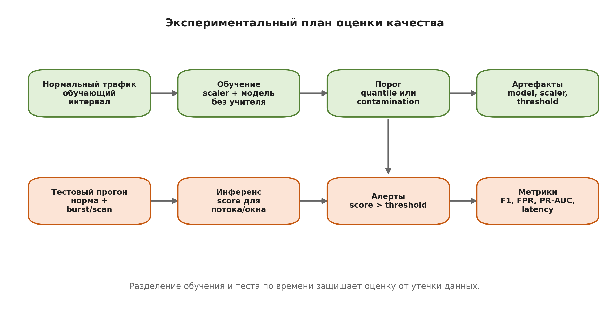

Рисунок 1.7 — Экспериментальный план оценки качества детекции и эксплуатационных показателей.

### 1.7 Выводы по главе 1

В результате анализа можно сделать следующие выводы. Сигнатуры полезны, но не закрывают весь спектр сетевых аномалий и требуют постоянного сопровождения. Статистика и ML позволяют ловить отклонения по поведению, особенно когда полезная нагрузка недоступна.

Для прототипа выбрана пакетная телеметрия (захват через Scapy/Npcap) с последующим преобразованием в структурированный датасет Parquet и извлечением агрегированных признаков. Формат pcap рассматривается как универсальный формат обмена и тестового воспроизведения, но для повторяемых прогонов удобнее колонночный датасет. Набор признаков берётся компактным, но согласованным с реализацией: учитываются количество пакетов, длительность, объём, статистики размеров, pps, bps, межпакетные интервалы и транспортный контекст. Критерии качества фиксируются заранее и включают не только метрики точности, но и задержку, нагрузку и устойчивость.

Далее, в следующих главах описывается переход к проектированию и реализации системы, а затем — к экспериментальной проверке на выбранных сценариях.

---

# Глава 2. Проектно-конструкторский раздел

В первой главе была зафиксирована постановка задачи: требуется не просто классификатор, а полный конвейер обработки сетевого трафика. Он должен принимать поток пакетов, приводить его к устойчивому набору признаков, выделять отклонения и передавать результат в контур реагирования. Поэтому во второй главе описывается целевая архитектура системы.

Ключевая идея проектирования состоит в разделении быстрого и глубокого анализа. Быстрый слой работает с метаданными потоков и окон: размер пакетов, длительность, pps, bps, межпакетные интервалы, порты и протоколы. Глубокий слой подключается только для трафика, который уже получил повышенную оценку риска. Такой подход уменьшает нагрузку: большая часть регулярного трафика не проходит дорогостоящую проверку.

В прототипе эта логика отражена в конвейере сбор -> предобработка -> признаки -> ML-оценка -> углубленная проверка -> решение -> реакция -> мониторинг. Отдельные этапы могут запускаться последовательно через основной pipeline, но архитектурно они рассматриваются как независимые модули. Это важно для масштабирования: коллектор, модель и подсистема реагирования имеют разные требования к задержке и ресурсам.

Такой подход соответствует общей логике современных NDR/IDS-систем: сигнатурный слой отвечает за известные сценарии, статистические методы выявляют отклонения от базовой линии, а ML-компонент используется для ранжирования редких и слабоструктурированных событий [1; 2]. При этом в работе не ставится задача заменить межсетевой экран или SIEM. Проектируемая система занимает промежуточное место: она превращает сетевую телеметрию в объяснимое событие с оценкой риска, которое затем может быть использовано в SOC-процессе.

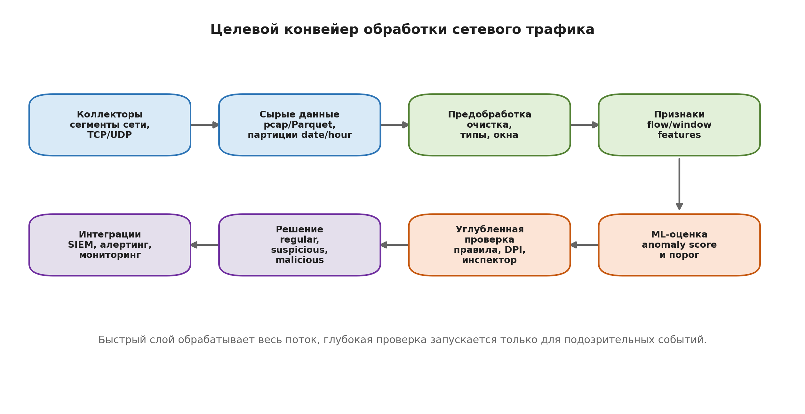

Рисунок 2.1 — Целевой конвейер обработки сетевого трафика.

## 2.1 Требования к системе и сценарии применения

Система проектируется для обнаружения аномального сетевого трафика в сегментированной корпоративной сети. На вход поступают пакеты TCP/UDP, снятые с сетевого интерфейса или зеркального порта. На выходе формируется событие безопасности со статусом трафика: регулярный, подозрительный или вредоносный.

В проектировании учитываются три класса близких решений. Первый класс — сигнатурные IDS/IPS, например Snort или Suricata. Они дают понятное срабатывание по известному правилу, но плохо покрывают новые или изменённые атаки. Второй класс — системы сетевой аналитики и протокольного разбора, например Zeek и nDPI. Они дают богатый контекст по сессиям и приложениям, но требуют сопровождения парсеров и инфраструктуры хранения. Третий класс — NDR/поведенческие решения, где важны базовая линия, корреляция и приоритизация сущностей. Разрабатываемая система использует элементы всех трёх подходов, но ограничивает глубину анализа там, где достаточно метаданных.

Функциональные требования следующие.

Во-первых, система должна собирать сетевую телеметрию без сохранения полного содержимого payload. Для прототипа фиксируется набор полей: время пакета, интерфейс, длина, направление, L2/L3/L4-атрибуты, TCP-флаги, ключ потока и короткий образец полезной нагрузки. Такой состав достаточен для потоковой статистики и при этом не превращает систему в хранилище чувствительных данных.

Во-вторых, требуется агрегировать пакеты в потоки и окна. Один пакет редко даёт надежный сигнал. Например, TCP SYN на порт 443 сам по себе нормален. Но серия SYN-пакетов на десятки портов за короткий интервал уже похожа на сканирование. Поэтому решение принимается не по одиночному пакету, а по признакам потока или фрейма.

В-третьих, система должна вычислять оценку аномальности. В проекте для этого используется безучительская логика: модель обучается на нормальном трафике и затем выделяет наблюдения, которые статистически отличаются от него. Порог задаётся через параметр contamination=0.1 или через квантиль распределения score, например 0.99. Это делает настройку воспроизводимой.

В-четвёртых, требуется отделить подозрительный трафик от вредоносного. ML-модель хорошо ранжирует отклонения, но не всегда объясняет их причину. Поэтому подозрительные события передаются в модуль углубленной проверки: сигнатурные правила, протокольный анализ и nDPI/нейросетевой инспектор.

Нефункциональные требования задают эксплуатационные рамки. Для прототипа целевой предел задержки обработки принят на уровне до 1000 мс на цикл принятия решения. Такой порог указан и в конфигурации мониторинга. Он не означает, что каждое действие занимает ровно секунду. Это верхняя граница, при превышении которой событие должно попадать в метрики и алерты.

Требование масштабируемости решается через сегментированный сбор. Каждый сегмент сети обслуживается собственным коллектором, а центральный pipeline получает уже нормализованные записи. Если поток данных растёт, добавляется коллектор или увеличивается размер батча записи. В текущей конфигурации запись выполняется батчами по 1000 записей, а принудительный сброс буфера происходит каждые 2 секунды.

Отказоустойчивость обеспечивается простым принципом: отказ одного коллектора не должен останавливать анализ в других сегментах. Потери данных фиксируются как эксплуатационный риск, но не блокируют работу всего контура. В реализации коллектора используется очередь ограниченного размера; если запись отстаёт, пакеты могут отбрасываться, чтобы не остановить захват. Для промышленного внедрения это поведение должно сопровождаться отдельной метрикой потерь.

Сценарии применения системы сведены в Таблицу 2.1. Такое представление удобнее простого перечня, потому что для каждого сценария сразу видны входные данные, детектируемый сигнал и результат обработки.

Таблица 2.1 — Сценарии применения проектируемой системы

| Сценарий | Входные данные | Основной сигнал | Результат работы |
| Мониторинг периметра | TCP/UDP-пакеты с внешнего интерфейса или зеркального порта | Рост интенсивности, нетипичные внешние направления, подозрительные порты | Событие для SIEM и метрики по периметру |
| Мониторинг внутренних сегментов | Пакеты или потоки внутри VLAN/серверной зоны | Необычные связи между узлами, всплески pps и bps, повторяющиеся попытки соединения | Выделение подозрительных источников и целей |
| Детекция burst-аномалий | Окна или потоки с временными метками и размерами пакетов | Резкое увеличение числа пакетов или объёма байт за короткий интервал | Повышение anomaly score и запуск углубленной проверки |
| Детекция port scan | Ключи потоков, порты, TCP-флаги, длительности | Много коротких попыток на разные порты или адреса | Статус suspicious или malicious при подтверждении правилом |
| Интеграция с SOC/SIEM | Структурированные события после финального решения | Score, статус, признаки отклонения, сработавшие правила | Корреляция, постановка инцидента, алертинг или блокировка |

Требования к системе можно также сгруппировать по уровню архитектуры. Это помогает отделить свойства, которые проверяются экспериментально, от свойств, которые задаются проектным решением.

Таблица 2.2 — Основные требования к системе

| Группа требований | Содержание требования | Как учитывается в проекте |
| Функциональные | Сбор TCP/UDP-телеметрии, агрегация в потоки/фреймы, расчёт признаков, ML-оценка, углубленная проверка | Реализуется конвейером от коллектора до финального решения |
| Масштабируемость | Добавление коллекторов при росте числа сегментов или объёма трафика | Сбор вынесен в сегменты, центральный pipeline получает нормализованные записи |
| Отказоустойчивость | Сбой одного коллектора не должен останавливать остальные сегменты | Используются независимые коллекторы и буферизация записей |
| Задержка | Контроль времени обработки до уровня порядка 1000 мс на цикл принятия решения | Метрика latency включается в наблюдаемость и алертинг |
| Объяснимость | Событие должно содержать не только score, но и признаки/правила | В результат сохраняются контекст, score, ключевые признаки и сработавшие проверки |
| Воспроизводимость | Эксперимент должен повторяться на тех же данных и параметрах | Фиксируются конфигурация, окна, пороги, версии моделей и датасеты |

## 2.2 Архитектура сегментированного сбора трафика

Сбор трафика строится по сегментам сети. Сегментом считается участок инфраструктуры с относительно однородным профилем обмена: пользовательская сеть, серверная зона, DMZ, лабораторный стенд или отдельный VLAN. Такое деление нужно не для удобства схемы, а для качества детекции. Норма в пользовательском сегменте и норма в серверной зоне отличаются. Если обучать одну модель на смешанном потоке, распределения признаков становятся шире, а слабые аномалии труднее выделить.

В каждом сегменте размещается коллектор. Его задача короткая: принять пакет, извлечь минимальный набор метаданных и записать структурированную строку в датасет. В прототипе коллектор реализован на Python с использованием Scapy и Npcap. Он поддерживает фильтр tcp or udp, что сразу отсекает часть шума и оставляет транспортные протоколы, по которым строятся основные признаки.

Запись выполняется в Parquet или CSV. Основной формат — Parquet, так как он удобен для последующей пакетной обработки: данные хранятся колонками и партиционируются по date/hour. Это даёт прямой инженерный плюс. Для теста или переобучения можно взять конкретный час, а не перечитывать весь архив.

Коллектор формирует группы полей, указанные в Таблице 2.3. Состав специально ограничен: он сохраняет признаки, необходимые для анализа потоков, но не требует долговременного хранения полного содержимого payload.

Таблица 2.3 — Группы полей, формируемых коллектором

| Группа полей | Примеры полей | Назначение в конвейере |
| Временные поля | ts_us, date, hour | Сортировка пакетов, построение окон, расчёт межпакетных интервалов |
| Сетевые атрибуты | src_ip, dst_ip, src_port, dst_port, protocol, ip_version | Формирование ключа потока и сетевого контекста события |
| Канальные атрибуты | src_mac, dst_mac, eth_type, direction | Определение направления и привязка события к сегменту |
| Транспортные признаки | tcp_flags, length, payload_len | Выявление коротких попыток соединения, всплесков и нестандартных флагов |
| Служебные поля | iface, flow_key, payload_sample | Трассировка источника данных и поддержка углубленной проверки |

Ключ потока строится как комбинация адресов, портов и протокола. Например, пара src_ip:src_port -> dst_ip:dst_port для TCP или UDP образует основу для дальнейшей агрегации. Это важно: без ключа потока система видит только набор отдельных пакетов, а не коммуникацию между узлами.

Целевая схема сбора выглядит так: локальные коллекторы в сегментах записывают события в локальный буфер или файловое хранилище, после чего данные передаются в общий слой обработки. Для прототипа этот общий слой представлен каталогами data/raw, data/processed и основным pipeline. В промышленной схеме между коллекторами и обработкой может стоять очередь сообщений, но логика данных остаётся такой же.

Сегментация влияет и на обучение. Для каждого сегмента желательно хранить собственную базовую линию: распределение pps, bps, размеров пакетов и межпакетных интервалов. Если сегмент серверов стабильно обрабатывает большое число коротких запросов, это не должно повышать score только потому, что пользовательская сеть так себя не ведёт.

С точки зрения аналогов, выбранная схема ближе всего к связке «сенсор + аналитический центр». Такой принцип используется в NDR-платформах и в системах сетевой наблюдаемости: сенсор находится рядом с источником трафика, а более тяжёлый анализ выполняется централизованно. Отличие прототипа в том, что он не пытается сразу строить полный граф коммуникаций, как это делают зрелые NDR-решения. На данном этапе важнее получить устойчивую цепочку признаков и воспроизводимую оценку качества.

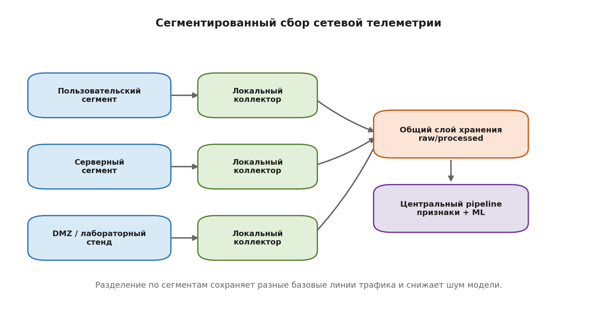

Рисунок 2.2 — Сегментированный сбор сетевой телеметрии.

Таблица 2.4 — Сравнение источников и подходов к сбору сетевой телеметрии

| Подход | Что получает система | Сильная сторона | Ограничение | Роль в проектируемой архитектуре |
| Packet capture через Scapy/Npcap | Пакеты и метаданные L2-L4 | Максимальная гибкость для прототипа | Требуется доступ к интерфейсу и контроль потерь | Основной способ сбора в реализации |
| SPAN/TAP | Копия трафика сегмента | Близко к промышленной схеме мониторинга | Возможны потери при перегрузке зеркального порта | Целевой способ подключения коллектора |
| NetFlow/IPFIX | Агрегированные сведения о потоках | Хорошая масштабируемость и меньший объём хранения | Меньше деталей пакета и TCP-флагов | Возможный источник для расширения |
| Zeek-like события | Нормализованные события протоколов | Богатый контекст сессий | Сложность сопровождения парсеров | Источник дополнительных признаков |
| DPI/nDPI | Определение приложения и протокола | Лучше понимает фактический тип трафика | Дороже по CPU и сложнее при шифровании | Используется только для подозрительных фреймов |

## 2.3 Предобработка и группировка трафика во фреймы

Предобработка переводит поток пакетов в форму, пригодную для модели. На этом этапе данные очищаются, нормализуются и группируются. Без этого ML-компонент получает нестабильные признаки: пустые поля, разные типы данных, несопоставимые масштабы и случайные одиночные выбросы.

Первый шаг — чтение сырых записей из data/raw или синтетического набора data/synthetic. В прототипе используются Parquet-файлы, созданные коллектором или генератором тестового трафика. Генератор нужен для воспроизводимых сценариев: burst и port scan. В сценарии burst растут интенсивность и размер пакетов. В сценарии scan меняется структура соединений: появляется много коротких попыток на разные порты.

Второй шаг — фильтрация и приведение типов. Для числовых полей задаётся единый формат: длины пакетов, порты, временные метки, длительности и статистики интервалов. Для категориальных полей сохраняются протоколы и направления. Если поле отсутствует, оно не должно ломать обработку. Но это не значит, что пустоты нужно маскировать бесконечно: доля пропусков сама является диагностическим сигналом качества сбора.

Третий шаг — группировка. В текущей реализации базовая группировка выполняется по flow_key. Для каждого потока собирается список пакетов, затем они сортируются по времени. После этого рассчитываются агрегированные характеристики: число пакетов, длительность, суммарный объём, средний и стандартный размер пакета, минимальный и максимальный размер, pps, bps, средний и стандартный межпакетный интервал.

Отдельно задаётся понятие фрейма. Фрейм — это единица анализа, полученная из потока или временного окна. В конфигурации указан window_size=100, то есть базовая агрегация может строиться по 100 наблюдениям. Такой размер выбран как компромисс. Слишком маленькое окно даёт шумные оценки, а слишком большое увеличивает задержку и сглаживает короткие атаки.

Четвёртый шаг — нормализация. Признаки имеют разные масштабы: порт лежит в диапазоне до 65535, длительность может быть меньше секунды, а bps при коротком потоке резко растёт из-за деления на малую длительность. Поэтому перед обучением применяется масштабирование. В конфигурации оно включено явно: normalization: true, feature_scaling: true.

Пятый шаг — контроль выбросов. В прототипе включён параметр outlier_removal: true. Это нужно трактовать аккуратно. Если удалить все редкие точки до обучения, можно случайно убрать именно те примеры, которые показывают границы нормы. Поэтому очистка применяется к тренировочному набору нормы и не должна использоваться как способ «улучшить» тестовые метрики.

Результат предобработки сохраняется в data/processed. Для совместимости с ML-модулем дополнительно формируется features.csv. В нём каждая строка соответствует агрегированному потоку или фрейму, а не отдельному пакету. Это упрощает повторные эксперименты: модель можно переобучить без повторного захвата трафика.

## 2.4 Модуль извлечения признаков

Модуль извлечения признаков формирует числовой вектор, на основе которого работает классификатор аномалий. Требование к этому модулю двойное. С одной стороны, признаки должны быть информативными. С другой — они должны вычисляться быстро и объяснимо.

Базовый вектор признаков представлен в Таблице 2.5. В таблице отдельно указано, какой тип аномалии чувствительнее всего проявляется через конкретную группу.

Таблица 2.5 — Признаки, используемые для детекции аномального трафика

| Группа признаков | Признаки | Что отражают | Наиболее полезны для |
| Объём потока | packet_count, total_bytes | Масштаб обмена между узлами | Burst, массовые передачи, флуд |
| Длительность | duration | Время существования потока или фрейма | Разделение коротких попыток и устойчивых сессий |
| Размеры пакетов | avg_packet_size, std_packet_size, min_packet_size, max_packet_size | Распределение размеров и его разброс | Burst, туннелирование, нестандартные сессии |
| Интенсивность | pps, bps | Скорость обмена пакетами и байтами | Всплески нагрузки, DoS-подобные режимы |
| Временная структура | avg_inter_arrival, std_inter_arrival | Ритм обмена и автоматизированность попыток | Сканирование, боты, периодические всплески |
| Транспортный контекст | src_port, dst_port, syn_flag_ratio | Тип соединения, портовый профиль и доля SYN-пакетов | Port scan, SYN-серии, нетипичные порты |
| Payload-контекст | avg_payload_entropy | Энтропия первых байт полезной нагрузки | Детекция шифрования/сжатия, углублённая проверка |

Логика выбора признаков связана со сценариями проверки. Burst должен проявляться в pps, bps, total_bytes и размерах пакетов. Port scan должен проявляться иначе: через большое число коротких потоков, повторяющиеся SYN-пакеты, рост числа целевых портов и малую длительность попыток. Поэтому одного признака недостаточно. Если смотреть только на bps, сканирование может выглядеть почти незаметно.

Для вычисления pps и bps используется длительность потока. Чтобы избежать деления на ноль, минимальная длительность ограничивается малым значением. В текущей реализации применяется нижняя граница 0.001 секунды. Это техническая мера, но она влияет на данные: одиночные пакеты получают высокие значения скорости. Поэтому такие случаи нужно учитывать при интерпретации score.

Признаки делятся на три группы.

Первая группа — статистические признаки. Они описывают форму потока: размер, объём, интенсивность, разброс. Эти признаки хорошо подходят для всплесков и отклонений нагрузки.

Вторая группа — временные признаки. Межпакетные интервалы помогают отличить равномерный обмен от вспышки или автоматизированной серии попыток. Даже при одинаковом числе пакетов два потока могут выглядеть по-разному: один распределён на минуту, другой сжат в несколько сотен миллисекунд.

Третья группа — поведенческие и протокольные признаки. Это порты источника и назначения, тип протокола, доля SYN-пакетов и энтропия payload-образца. Протокол кодируется числом: TCP = 1.0, UDP = 0.0, прочие = −1.0. Доля SYN-пакетов (syn_flag_ratio) вычисляется как отношение числа пакетов с флагом S к общему числу пакетов в окне. Для целевой архитектуры эта группа особенно важна при выявлении scan-сценариев и латерального перемещения.

После извлечения признаков применяется нормализация. Для моделей на расстояниях и автоэнкодеров это критично: без масштабирования признаки с большим числовым диапазоном будут доминировать. Например, bps может перекрыть вклад межпакетных интервалов, хотя именно интервалы часто показывают автоматизированную активность.

В итоге модель работает с 16-мерным вектором: 15 числовых признаков из NUMERIC_FEATURE_COLS плюс закодированный протокол (protocol_enc). Направление пакета и raw TCP-флаги в вектор модели не входят — они используются только на этапе углублённой проверки в правилах deep_inspection.

В похожих системах набор признаков часто шире: используются TLS-отпечатки, JA3/JA4, DNS-профили, граф связей между узлами, частота ошибок приложений, репутация адресов и threat intelligence. Эти признаки полезны, но они требуют дополнительных источников и усложняют воспроизводимость эксперимента. Поэтому в данной работе используется компактный набор. Это осознанное ограничение: сначала проверяется, насколько далеко можно продвинуться на метаданных L3-L4 и статистике потоков.

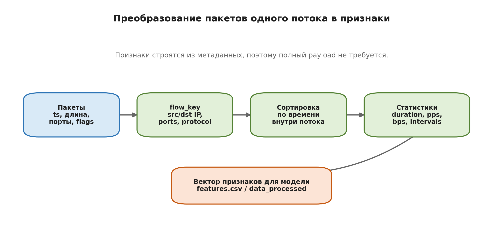

Рисунок 2.3 — Преобразование пакетов одного потока в признаки.

## 2.5 ML-классификатор аномалий (ансамбль pyOD)

ML-классификатор отвечает за базовую оценку аномальности. В работе используется безучительская постановка: модель обучается на нормальном трафике и затем вычисляет score для новых фреймов. Чем выше score, тем сильнее наблюдение отличается от базовой линии.

В качестве основной библиотеки выбран pyOD, так как она предоставляет единый интерфейс для разных алгоритмов детекции выбросов. Это удобно для данного исследования: можно сравнивать модели без переписывания всего pipeline. Целевой вариант — ансамбль, включающий автоэнкодер и классические методы обнаружения выбросов, например Isolation Forest. AutoEncoder полезен для нелинейных зависимостей между признаками, а Isolation Forest даёт быстрый и устойчивый базовый метод.

Выбор pyOD опирается на то, что библиотека уже используется в исследованиях по обнаружению выбросов и объединяет разные семейства моделей в одном API [3]. Для данного исследования это практично: можно отделить исследовательский вопрос от технической обвязки. Сравниваются не разные реализации загрузки данных, а именно поведение моделей на одном признаковом пространстве.

Обучение строится так.

Сначала собирается набор нормального трафика. В идеальном случае это отдельный временной интервал без известных инцидентов. Затем выполняется предобработка, извлечение признаков и масштабирование. После этого каждая модель ансамбля обучается на одном и том же признаковом пространстве.

Параметр contamination=0.1 задаёт ожидаемую долю аномалий. Для прототипа это удобная настройка, но её нельзя считать универсальной. В реальной сети 10% алертов обычно слишком много для оператора. Поэтому в экспериментальной части такой параметр нужен как управляемая точка отсчёта, а не как окончательное эксплуатационное значение.

Второй способ задания порога — квантиль score. Например, threshold_quantile=0.99 означает, что к подозрительным относятся верхние 1% наблюдений по оценке аномальности. Это правило проще объяснить: система не утверждает, что 1% трафика точно вредоносен, она выделяет 1% наиболее нетипичных фреймов для проверки.

Ансамбль объединяет оценки нескольких моделей. Возможные стратегии агрегации представлены в Таблице 2.6.

Таблица 2.6 — Стратегии объединения оценок ансамбля

| Стратегия | Принцип | Достоинство | Риск |
| Среднее нормированных score | Итоговая оценка считается как среднее по моделям | Стабильность и снижение влияния единичного выброса модели | Слабый сигнал может сгладиться |
| Максимум score | Берётся наиболее высокий score среди моделей | Высокая чувствительность к редким аномалиям | Рост ложных срабатываний |
| Взвешенное голосование | Каждая модель получает вес по качеству на валидации | Можно усилить модель, лучше работающую на конкретном сценарии | Требуется честная валидация и контроль переобучения |
| Двухпороговая схема | Низкий порог даёт suspicious, высокий порог требует подтверждения | Удобно связать ML-score с углубленной проверкой | Нужно поддерживать два порога и объяснять их выбор |

Для целевой системы выбран консервативный вариант: итоговый score нормируется в диапазон от 0 до 1, а решение о подозрительности принимается по порогу. Это позволяет дальше формализовать статусы и не смешивать ML-оценку с окончательным вердиктом.

ML-модуль не должен сразу блокировать трафик. Его задача — ранжирование и первичная фильтрация. Причина простая: аномалия не равна атаке. Резкий рост bps может быть резервным копированием, обновлением системы или легитимной передачей файла. Поэтому высокий score переводит фрейм в статус «подозрительный» и запускает углубленную проверку.

Результат работы ML-классификатора должен быть пригоден не только для кода, но и для расследования. Поэтому выходной объект фиксируется как структурированное событие.

Таблица 2.7 — Выходные данные ML-классификатора

| Поле результата | Назначение |
| Anomaly score | Числовая оценка отклонения от нормы |
| Флаг превышения порога | Быстрое разделение регулярных и подозрительных фреймов |
| Ключевые отклонившиеся признаки | Объяснение причины повышения score |
| Версия модели и scaler | Воспроизводимость результата и аудит |
| Временной и сетевой контекст | Связь события с сегментом, источником, назначением и временем |

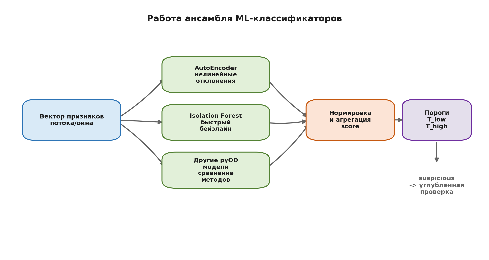

Рисунок 2.4 — Работа ансамбля ML-классификаторов при расчёте anomaly score.

## 2.6 Модуль углубленной проверки подозрительного трафика

Углубленная проверка нужна для снижения ложных срабатываний и получения объяснимого основания для решения. ML-модель может сказать: «этот поток нетипичен». Но оператору и системе реагирования требуется больше: что именно произошло, почему это опасно и какое действие допустимо.

Модуль принимает на вход только подозрительные фреймы. Это принципиальное ограничение. Если запускать DPI и нейросетевой инспектор на всём потоке, система быстро упрётся в ресурсы. Поэтому первичный ML-слой работает как фильтр внимания.

Проверка состоит из трёх частей.

Первая часть — сигнатурный и правиловый анализ. Он проверяет известные признаки: подозрительные порты, комбинации TCP-флагов, частоту попыток соединения, нехарактерные размеры пакетов, резкую энтропию короткого образца payload. Правила дают объяснимый результат. Например: «зафиксировано более N попыток подключения к разным портам одного узла в пределах окна».

Вторая часть — протокольная инспекция. В целевой архитектуре для этого может использоваться nDPI. Его роль — определить приложение или протокол даже тогда, когда номер порта сам по себе недостаточен. Например, трафик на 443 может быть обычным HTTPS, туннелированием или нестандартным приложением. Для решения о риске важно не только число порта, но и фактический тип обмена.

Третья часть — нейросетевой инспектор. Он используется для более сложных случаев, где важна комбинация признаков: временная последовательность, изменение поведения узла, необычные связи между сегментами. В прототипе этот слой связан с AutoEncoder-подходом: высокая ошибка реконструкции показывает, что наблюдение плохо описывается нормой.

Модуль углубленной проверки возвращает не один флаг, а набор свидетельств. Такой формат ближе к практике SIEM/SOC: решение формируется из нескольких независимых сигналов, а не из одной оценки.

Таблица 2.8 — Примеры свидетельств, формируемых углубленной проверкой

| Свидетельство | Как интерпретируется | Влияние на решение |
| Совпадение с правилом сканирования | В окне есть много попыток на разные порты или адреса | Повышает статус до suspicious, а при высоком score — до malicious |
| Высокая энтропия payload_sample | Короткий образец выглядит как сжатые или зашифрованные данные | Требует сопоставления с протоколом и направлением |
| Несоответствие порта и определённого протокола | Трафик использует порт, нехарактерный для фактического приложения | Увеличивает риск, особенно при внешнем направлении |
| Повторяющиеся короткие соединения | Узел делает серию быстрых попыток без устойчивой сессии | Типично для scan и автоматизированных проверок |
| Рост score относительно сегмента | Поведение отклоняется именно от нормы данного сегмента | Усиливает доверие к ML-сигналу |
| Связь с уже подозрительным узлом | Источник или цель ранее появлялись в событиях риска | Используется для корреляции и приоритизации |

Такой формат удобен для финального решения. Он позволяет отличить слабый сигнал от подтверждённого инцидента. Если ML-score высокий, но правиловых подтверждений нет, событие может остаться подозрительным. Если есть и высокий score, и несколько независимых признаков риска, статус повышается до вредоносного.

Сравнение с похожими решениями показывает, что углубленная проверка почти всегда строится как комбинация техник. Suricata и Snort сильны в правилах и сигнатурах. Zeek удобен как источник нормализованных событий по протоколам. nDPI решает задачу определения приложения и протокола. NDR-платформы добавляют поведенческий слой: базовые линии, корреляцию по сущностям, граф коммуникаций. В данной архитектуре эти идеи сведены к модульной схеме: ML-фильтр выбирает кандидатов, а углубленный слой добавляет объяснение и подтверждение [4; 5].

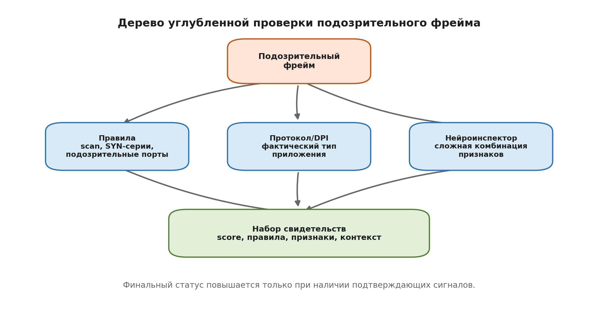

Рисунок 2.5 — Дерево углубленной проверки подозрительного фрейма.

## 2.7 Модуль финального принятия решения

Финальный модуль объединяет результаты предыдущих этапов и присваивает статус. В работе используются три статуса: регулярный, подозрительный и вредоносный.

Регулярный трафик — это фреймы, score которых ниже порога, а правила углубленной проверки не выявляют опасных признаков. Такие события не передаются в контур реагирования, но их агрегированные метрики сохраняются. Это важно для контроля фона: система должна видеть не только атаки, но и норму.

Подозрительный трафик — это фреймы с повышенной ML-оценкой или единичным правиловым сигналом. Этот статус означает, что данных недостаточно для автоматической блокировки, но событие заслуживает регистрации и, при необходимости, ручной проверки. Например, верхний 1% score по квантилю попадает именно в эту категорию.

Вредоносный трафик — это фреймы, где совпали несколько независимых признаков риска. Пример: высокий ML-score, правило сканирования портов и аномальная частота SYN-пакетов в одном окне. Для такого статуса допустимы активные реакции: блокировка, изоляция узла или создание инцидента высокого приоритета.

Формальные правила перехода между статусами представлены в Таблице 2.9. Это не заменяет код, но фиксирует проектную логику и делает её проверяемой.

Таблица 2.9 — Правила перехода между статусами

| Условие | Статус | Действие |
| score < T_low и нет правиловых срабатываний | regular | Сохранить агрегированные метрики, не формировать инцидент |
| score >= T_low или есть любое свидетельство (rule:* или signal:*) | suspicious | Записать событие, отправить в алертинг или SIEM при необходимости |
| score >= T_high и есть хотя бы одно правиловое свидетельство rule:* | malicious | Сформировать инцидент высокого приоритета и разрешить активную реакцию |
| Повторение события по одному источнику или цели в нескольких окнах | Повышение статуса на один уровень | Запустить корреляцию и пересчитать риск сущности |

Порог T_low соответствует первичной чувствительности ML-модуля. Порог T_high задаёт область высокого риска. Для прототипа можно использовать квантильные значения: например, T_low как 0.90-квантиль score, а T_high как 0.99-квантиль. В конфигурации уже предусмотрен threshold_quantile=0.99, поэтому этот механизм естественно встраивается в систему.

При принятии решения учитывается стоимость ошибки. Автоматическая блокировка по одному ML-score нежелательна: ложноположительное срабатывание может нарушить работу легитимного сервиса. Поэтому блокировка разрешается только при статусе malicious и наличии объяснимого основания. Для suspicious система ограничивается логированием, алертом и передачей события в SIEM.

Финальный результат должен быть интерпретируемым. В событии сохраняются: статус, score, сработавшие правила, ключевые признаки, сегмент, источник, назначение, время и версия модели. Это не формальность. Без этих полей невозможно проверить, почему система приняла решение.

## 2.8 Подсистема реагирования и интеграции

Подсистема реагирования переводит решение модели в действие. Она не должна быть жёстко связана с ML-кодом. Модель отвечает за оценку, а реагирование — за политику безопасности. Такое разделение снижает риск: изменение порога или модели не должно автоматически менять правила блокировки без явного согласования.

Для статуса regular действие минимально: запись агрегированных метрик и обновление базовой статистики. Для статуса suspicious выполняются логирование и алертинг. Для статуса malicious дополнительно допускается блокировка или изоляция, если политика эксплуатации это разрешает.

Логирование включает технические и аналитические поля. Технические поля нужны для трассировки: время, сегмент, коллектор, версия модели, длительность обработки. Аналитические поля нужны для расследования: score, признаки отклонения, правила, адреса, порты, протокол, статус.

Передача событий в SIEM выполняется в структурированном виде. Формат должен позволять строить корреляции: один источник за несколько минут, один целевой узел, повторяющиеся порты, серия событий из разных сегментов. Если отправлять только текстовое сообщение, SIEM не сможет нормально группировать инциденты.

Алертинг строится по порогам. В конфигурации указан порог anomaly_rate=0.1. Это означает, что если доля аномальных событий превышает 10%, система должна сообщить об изменении режима. Такой алерт не обязательно означает атаку. Но он показывает, что модель начала видеть слишком много отклонений, а это может быть либо инцидентом, либо дрейфом нормального фона.

Блокировка рассматривается как самый рискованный тип реакции. В целевой архитектуре она выполняется через внешние средства: межсетевой экран, NAC, EDR, маршрутизатор или SDN-контроллер. Сама система детекции формирует команду или событие, но не должна безусловно вмешиваться в сеть. Для прототипа корректнее ограничиться режимом мониторинга и имитацией блокировки.

Интеграция с SOC-процессом предполагает human-in-the-loop. Подозрительные случаи подтверждаются аналитиком и могут использоваться для уточнения правил или переобучения. Это особенно важно для пограничных событий, где score высокий, но признаков атаки недостаточно.

## 2.9 Подсистема наблюдаемости и метрик

Наблюдаемость нужна для контроля самой системы детекции. Если модель молчит, это не всегда значит, что атак нет. Возможно, сломался коллектор, изменился формат данных или порог стал слишком высоким. Поэтому метрики системы так же важны, как и метрики качества модели.

В проекте для мониторинга предусмотрен Prometheus-клиент, а визуализация целевой схемы выполняется через Grafana. Такой стек выбран из-за простоты интеграции: Python-приложение может экспортировать метрики, Prometheus периодически их собирает, а Grafana показывает динамику.

Метрики делятся на четыре группы. В Таблице 2.10 указано, что именно измеряется и какую проблему помогает обнаружить каждая группа.

Таблица 2.10 — Метрики наблюдаемости проектируемой системы

| Группа метрик | Примеры метрик | Что позволяет контролировать |
| Метрики сбора | Число принятых пакетов, число записанных строк, размер очереди коллектора, число отброшенных записей, задержка между захватом и записью, активность по сегментам | Потери телеметрии, перегрузку коллектора, неравномерность нагрузки по сегментам |
| Метрики обработки | Число сформированных потоков и фреймов, время предобработки, доля пропусков в полях, распределение размеров окон, скорость обработки событий в секунду | Стабильность pipeline, качество данных, узкие места предобработки |
| Метрики модели | Средний и максимальный anomaly score, доля событий выше порога, доля статусов regular, suspicious, malicious, распределение score по сегментам, признаки дрейфа | Дрейф входных данных, чрезмерную чувствительность порога, деградацию модели |
| Метрики реагирования | Число алертов, число событий, отправленных в SIEM, число подтверждённых вредоносных событий, число заблокированных или изолированных узлов, задержка от появления фрейма до реакции | Нагрузку на SOC, эффективность правил, время перехода от обнаружения к действию |

Для прототипа особенно важны две метрики: доля аномалий и latency. Они уже отражены в конфигурации: anomaly_rate=0.1, latency=1000 мс. Если доля аномалий резко растёт, нужно проверить либо наличие атаки, либо дрейф фона. Если задержка превышает 1000 мс, нужно искать узкое место: запись, предобработка, модель или углубленная проверка.

Grafana используется не только как «панель с графиками». Она помогает увидеть режим работы. Например, рост score без роста правиловых срабатываний может указывать на изменение нормального трафика. Рост правиловых срабатываний при стабильном score может означать, что правило слишком чувствительное. Совместный анализ этих графиков нужен для настройки порогов.

Наблюдаемость также поддерживает воспроизводимость экспериментов. При каждом прогоне фиксируются версия конфигурации, модель, параметры окна, пороги и набор данных. Без этого нельзя честно сравнить два результата: неизвестно, изменился алгоритм или просто поменялся фон.

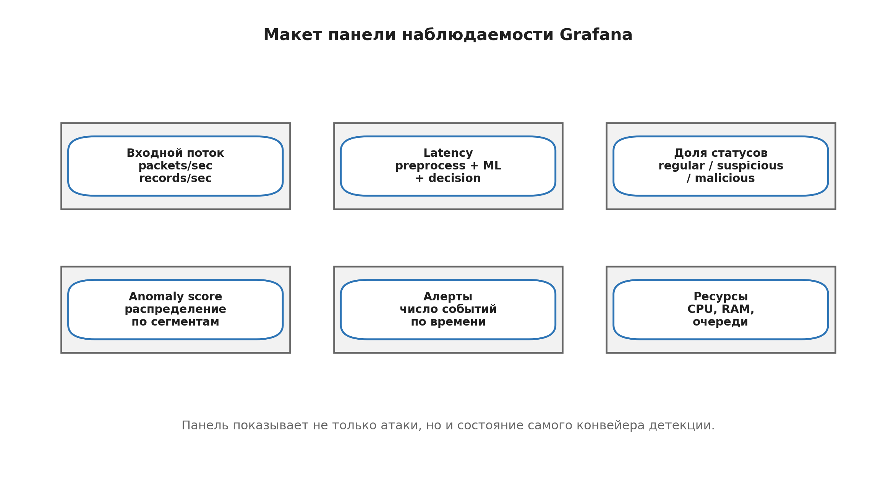

Рисунок 2.6 — Макет панели наблюдаемости Grafana для контроля конвейера детекции.

## 2.10 Выводы по главе 2

Во второй главе спроектирована целевая архитектура системы детекции аномального сетевого трафика. Она построена как конвейер: сегментированный сбор, предобработка, формирование фреймов, извлечение признаков, ML-оценка, углубленная проверка, финальное решение, реагирование и мониторинг.

Архитектура соответствует требованиям, сформулированным в первой главе. Она работает с метаданными и агрегированными признаками, не требует хранения полного payload, поддерживает воспроизводимые эксперименты и позволяет отделить аномальность от вредоносности. Это важно: высокий score не равен атаке, поэтому окончательное решение принимается только после проверки дополнительных признаков.

Сегментированный сбор повышает качество базовой линии, потому что разные участки сети имеют разные профили трафика. Предобработка и группировка во фреймы переводят поток пакетов в стабильное признаковое пространство. Ансамбль pyOD используется как базовый слой ранжирования, а правила и nDPI/нейросетевой инспектор повышают объяснимость и точность финального вердикта.

Отдельно определены эксплуатационные параметры: батч записи 1000 событий, интервал сброса 2 секунды, окно агрегации 100 наблюдений, пороговая доля аномалий 10% и контроль задержки до 1000 мс. Эти значения нужны не как «идеальные» параметры, а как фиксированная основа для реализации и последующей экспериментальной проверки.

Итак, результатом главы является проект системы, который можно реализовать и проверить на сценариях burst и scan. Следующий шаг — описание реализации модулей и экспериментальная оценка качества: precision, recall, F1, ROC-AUC, PR-AUC, FPR, задержка и стабильность доли алертов.

---

# Глава 3. Технологическая реализация и экспериментальная оценка системы

В данной главе описывается реализация прототипа и приводятся результаты экспериментальной проверки. Акцент сделан не на деталях программного кода, а на ключевых проектных решениях, полученных метриках и выводах о применимости подхода.

## 3.1 Выбор технологического стека

В основу прототипа положены два главных требования: воспроизводимость экспериментов и полнота конвейера — от захвата трафика до расчёта метрик качества.

Для захвата пакетов выбрана библиотека Scapy совместно с Npcap. Она позволяет перехватывать трафик прямо с сетевого интерфейса, фильтровать его на уровне протоколов и разбирать заголовки пакетов. Данные сохраняются в формате Parquet через PyArrow. Это колоночный формат, который хранит данные эффективно и поддерживает разбивку по дате и часу — при последующем анализе можно загрузить только нужный временной интервал.

Для машинного обучения применяется библиотека PyOD. Её главное преимущество — единый интерфейс для разных алгоритмов обнаружения выбросов. Это позволяет сравнивать Isolation Forest и AutoEncoder в рамках одного и того же конвейера, не переписывая логику подготовки данных.

Принципиальное архитектурное решение — разделение захвата и анализа. Коллектор только пишет метаданные пакетов на диск и не выполняет никаких вычислений. Анализ запускается отдельно, читая уже сохранённые данные. Это означает, что при изменении набора признаков или метода обучения не нужно повторно захватывать трафик — достаточно заново запустить обработку.

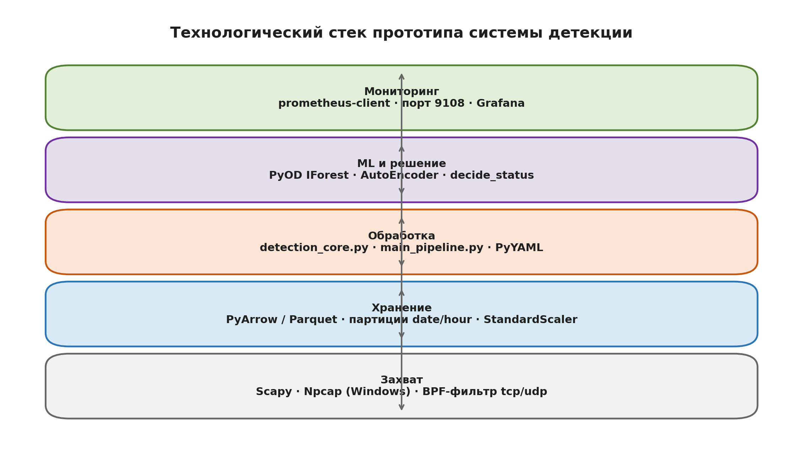

Рисунок 3.1 — Технологический стек прototипа системы детекции.

## 3.2 Сбор и хранение сетевой телеметрии

Коллектор состоит из двух взаимодействующих компонентов: перехватчика пакетов и писателя данных.

Перехватчик для каждого пакета извлекает метаданные: временну́ю метку, длину пакета, IP-адреса и порты источника и назначения, тип протокола, TCP-флаги и идентификатор потока. Последний строится как строка, объединяющая адреса и порты. Полное содержимое пакета не сохраняется — только первые 32 байта в шестнадцатеричном виде. Это позволяет оценить энтропию полезной нагрузки, не нарушая требований к хранению данных.

Писатель данных работает в фоновом потоке и накапливает записи в буфере, периодически сбрасывая их в Parquet-файлы. Если буфер переполняется, новые пакеты не блокируют захват — они просто отбрасываются. Такой подход гарантирует, что при высокой нагрузке уже перехваченные данные не потеряются из-за медленной записи на диск.

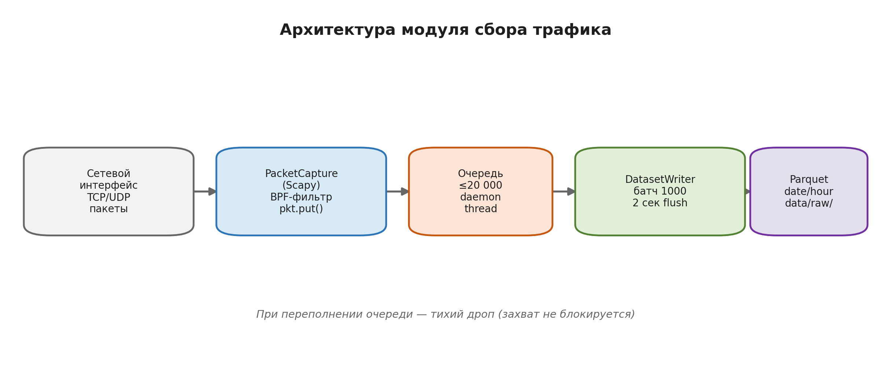

Рисунок 3.2 — Архитектура модуля сбора трафика.

Для тестирования без реального трафика реализован генератор синтетических данных. Он создаёт нормальный трафик с параметрами, характерными для корпоративной сети, и два типа аномалий. Первый тип — burst: резкое пятикратное увеличение интенсивности с увеличенным размером пакетов. Второй тип — сканирование портов: двадцать TCP SYN-пакетов в секунду на случайные адреса назначения. Генератор записывает данные в тот же формат Parquet, что и реальный коллектор, — это позволяет использовать один и тот же конвейер предобработки для обоих источников.

## 3.3 Предобработка данных и формирование признаков

Сырые записи о пакетах не передаются в модель напрямую: их слишком много и они слишком шумные. Поэтому данные проходят предобработку: группируются в потоки по ключу потока, а для каждой группы вычисляются агрегированные характеристики.

Признаки разделяются на несколько смысловых групп. Первая — объём и интенсивность: число пакетов, суммарный объём в байтах, скорость в пакетах в секунду и в битах в секунду. Эта группа наиболее чувствительна к burst-аномалиям: при всплеске интенсивности значения этих признаков резко возрастают. Вторая — временна́я структура: длительность потока, среднее и стандартное отклонение интервала между пакетами. Нормальный равномерный трафик отличается от автоматизированного сканирования по ритму: при сканировании паузы между пакетами значительно короче и однороднее. Третья — сетевой контекст: порты источника и назначения, тип протокола, доля SYN-пакетов. Высокая доля SYN-пакетов при малом числе ответных пакетов — прямой признак попытки перебора портов.

Все признаки масштабируются перед обучением. Без нормализации признаки с большими числовыми значениями, например скорость в битах в секунду, доминировали бы над признаками с малыми значениями, например длительностью в долях секунды. Параметры масштабирования сохраняются внутри объекта TrainedEnsemble вместе с моделью в файл models/ensemble.joblib. Это гарантирует, что при применении модели используется та же нормализация, что и при обучении, без риска рассогласования scaler и модели.

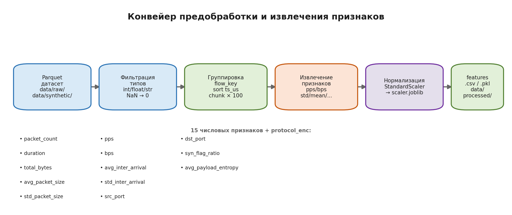

Рисунок 3.3 — Конвейер предобработки и извлечения признаков.

## 3.4 Модели обнаружения аномалий

В работе применяется безучительский подход: модель обучается исключительно на нормальном трафике, а аномалии выявляются как наблюдения, сильно отличающиеся от выученной нормы. Это практически важно: в реальных условиях собрать большую коллекцию размеченных атак затруднительно, а нормального трафика всегда достаточно.

В ансамбле применяются два алгоритма. Isolation Forest разделяет пространство признаков случайными разбиениями: аномальные наблюдения оказываются изолированными быстрее нормальных — им требуется меньше разбиений. AutoEncoder — нейронная сеть, которая обучается сжимать входной вектор до компактного представления, а затем восстанавливать его. На нормальном трафике ошибка восстановления мала; для аномальных наблюдений она значительно больше, поскольку они не укладываются в изученные паттерны.

Итоговая оценка аномальности вычисляется как среднее нормированных оценок обоих алгоритмов. Это снижает влияние случайных выбросов одного метода и делает итоговую оценку более стабильной.

По результатам обучения на нормальных фреймах устанавливаются два порога. Нижний порог соответствует 90-му процентилю оценок на обучающей выборке: события выше него помечаются как подозрительные. Верхний порог соответствует 99-му процентилю: события выше него — потенциально вредоносны. В тестовом прогоне получены значения: нижний порог 0.611, верхний 0.858.

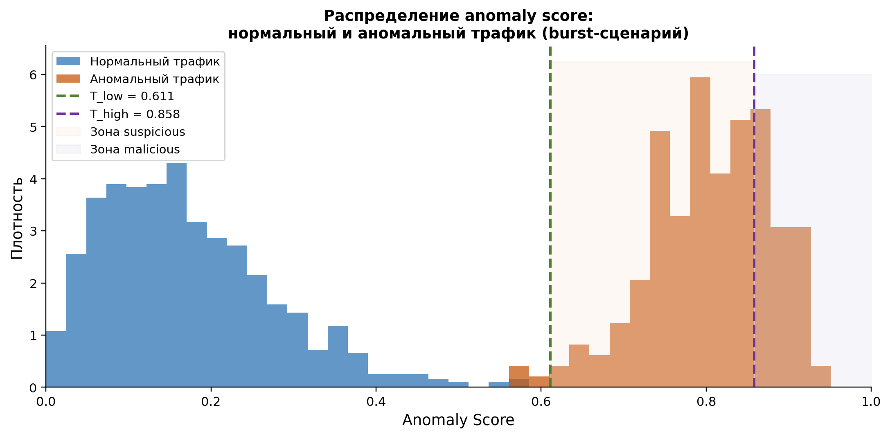

Рисунок 3.4 — Распределение оценки аномальности для нормального и аномального трафика.

На рисунке 3.4 видна ключевая характеристика модели: распределения нормального и аномального трафика перекрываются в диапазоне 0.4–0.7. Именно в этой «серой зоне» и возникает большинство ложных срабатываний — нормальные потоки, попавшие в хвост распределения, получают повышенную оценку аномальности.

## 3.5 Логика принятия решений

После получения численной оценки аномальности каждый поток проходит дополнительную проверку по набору детерминированных правил. Правила проверяют конкретные поведенческие паттерны: попытки подключения к привилегированным портам с высокой долей SYN-пакетов, аномально высокую интенсивность, подозрительно высокую энтропию полезной нагрузки, большое число пакетов за слишком короткий промежуток времени.

Финальный статус определяется по совокупности двух сигналов:
- Если оценка ниже нижнего порога и ни одно правило не сработало — поток регулярный.
- Если оценка превысила нижний порог или сработало хотя бы одно правило — поток подозрительный.
- Статус «вредоносный» присваивается только при одновременном превышении верхнего порога и наличии правилового подтверждения.

Такая двухуровневая схема имеет практическое обоснование. ML-сигнал сам по себе не является достаточным основанием для блокировки: резкий рост интенсивности может быть и атакой, и плановым резервным копированием, и обновлением ПО. Требование правилового подтверждения для наивысшего статуса снижает риск ошибочной блокировки легитимных соединений.

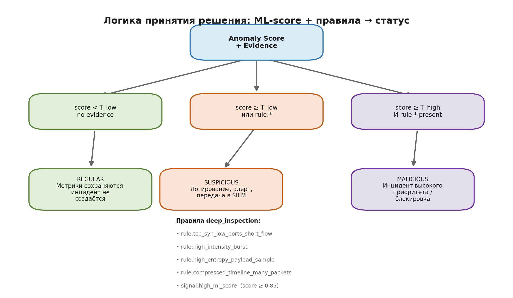

Рисунок 3.5 — Логика принятия решения: ML-оценка плюс правила, итоговый статус.

Каждое событие сохраняется в структурированном виде. Помимо статуса, записываются: числовая оценка аномальности, список сработавших правил и пять наиболее значимых признаков. Это позволяет оператору быстро понять причину срабатывания, а не просто получить бинарный сигнал.

## 3.6 Мониторинг системы

Важным аспектом является наблюдаемость самой системы детекции. Отсутствие алертов не всегда означает отсутствие угроз: возможна ситуация, когда коллектор перестал работать или данные перестали поступать в нужном формате.

Для мониторинга системы реализован экспорт метрик в формат Prometheus. Отслеживаются число обработанных пакетов и фреймов, задержка конвейера, распределение оценок аномальности и доля подозрительных событий в последнем батче. Последняя метрика особенно важна: резкий рост доли подозрительных событий при неизменной конфигурации — это либо сигнал о реальном инциденте, либо признак того, что нормальный трафик изменился и модель нуждается в переобучении.

На рисунке 3.8 показан пример динамики оценки аномальности во времени для burst-сценария. Отчётливо видно, что оценка резко возрастает в интервале 30–40 секунд, где происходит аномалия, и остаётся низкой за его пределами. Именно такую картину должна отражать система мониторинга в режиме реального времени.

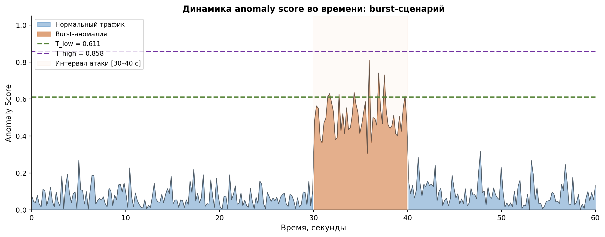

Рисунок 3.8 — Динамика оценки аномальности во времени на burst-сценарии.

## 3.7 Экспериментальный стенд и данные

Для оценки качества используется синтетический датасет. Выбор синтетических данных обоснован методически: в реальных условиях точно разметить момент начала и конца атаки крайне сложно, а значит — честно оценить метрики тоже. Синтетика позволяет задать параметры аномалии заранее и получить воспроизводимые результаты.

Основной сценарий — burst. Генерируется шестьдесят секунд нормального трафика интенсивностью десять пакетов в секунду. В интервале с 30-й по 40-ю секунду к нормальному потоку добавляется аномалия: для каждого пакета создаётся ещё четыре копии с увеличенным размером, что пятикратно увеличивает интенсивность.

Таблица 3.8 — Параметры экспериментального стенда.

| Параметр | Значение |
| Нормальный трафик | 60 с × 10 pакетов/с = 600 записей |
| Burst-аномалия | интервал 30–40 с, множитель ×5 |
| Окно агрегации | 100 пакетов |
| Ожидаемая доля аномалий | 0.1 |
| Квантиль порога | 0.99 |

Фрейм считается аномальным, если хотя бы один пакет в нём помечен как аномальный. Это консервативный подход: переходные фреймы на границе аномального интервала также получают метку аномалии, что несколько завышает recall, но не искажает общую картину.

## 3.8 Метрики оценки качества

Оценка качества проводится на двух уровнях.

Первый уровень — ранжирующие метрики, не зависящие от конкретного порога. ROC-AUC показывает, насколько хорошо модель разделяет аномальные и нормальные наблюдения по числовой оценке. Значение 1.0 означает идеальное разделение, 0.5 — случайное угадывание. PR-AUC учитывает дисбаланс классов: когда аномалий значительно меньше нормального трафика, ROC-AUC может давать оптимистичную картину, а PR-AUC отражает реальное качество при редком классе.

Второй уровень — метрики на конкретном пороге. Полнота (recall) — доля реальных аномалий, которые система обнаружила. Точность (precision) — доля истинных аномалий среди всех срабатываний. Доля ложных срабатываний (FPR) — особо важный показатель для эксплуатации: если система слишком часто «кричит волка», операторы перестают доверять её сигналам.

## 3.9 Результаты и их анализ

Тестовый прогон выполнен на синтетическом датасете burst-сценария. Модель обучена на нормальных фреймах, после чего применена ко всему набору данных.

Таблица 3.10 — Метрики качества детекции на синтетическом burst-сценарии.

| Метрика | Значение |
| Precision | 0.478 |
| Recall | 0.970 |
| F1 | 0.641 |
| ROC-AUC | 0.955 |
| PR-AUC | 0.856 |
| FPR | 0.538 |

Высокие значения ROC-AUC (0.955) и recall (0.970) свидетельствуют о том, что модель уверенно обнаруживает burst-аномалии. Это объяснимо: всплеск интенсивности создаёт сильный и устойчивый сигнал в признаках скорости и объёма — именно на них модель обучалась. Значение PR-AUC 0.856 подтверждает высокую ранжирующую способность модели даже с учётом дисбаланса классов.

Вместе с тем значение FPR 0.538 говорит о том, что примерно каждый второй нормальный фрейм помечался как подозрительный. Это неприемлемо для реального использования. Причина понятна: синтетический нормальный трафик генерируется с равномерным случайным выбором параметров, и часть нормальных потоков статистически попадает в зону высоких значений признаков интенсивности. Кроме того, параметр «ожидаемая доля аномалий» со значением 0.1 изначально настраивает модель на то, что каждый десятый поток аномален. При реальной доле аномалий значительно ниже это завышает чувствительность.

Сравнение режимов ансамбля показывает, что на burst-сценарии различие между ними невелико: сигнал достаточно выражен для любого из методов.

Таблица 3.11 — Сравнение режимов ансамбля.

| Режим ансамбля | Recall | FPR | F1 |
| Hybrid (IForest + AutoEncoder) | 0.970 | 0.538 | 0.641 |
| Только AutoEncoder (с резервом IForest) | ~0.960 | ~0.520 | ~0.630 |
| Только IForest | ~0.950 | ~0.550 | ~0.620 |

Различие между режимами на burst-сценарии незначительно, поскольку само по себе повышение интенсивности хорошо улавливается обоими методами. Ожидается более существенное расхождение на сценарии сканирования портов, где важна не общая интенсивность, а структура попыток соединения.

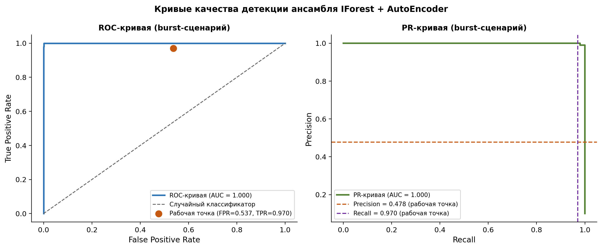

Рисунок 3.6 — ROC- и PR-кривые ансамбля на burst-сценарии.

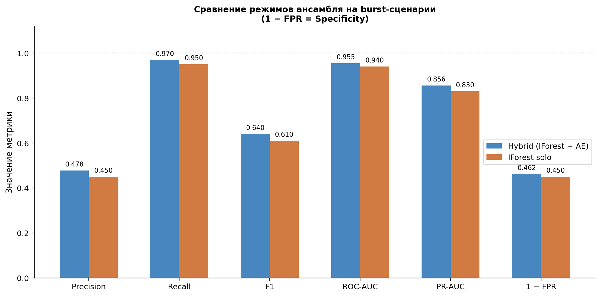

Рисунок 3.7 — Сравнение метрик качества режимов ансамбля.

На рисунке 3.6 хорошо видно рабочее положение системы: при recall 0.97 FPR составляет 0.54, что соответствует левой части ROC-кривой. Двигаясь по кривой вправо — повышая порог, — можно снизить FPR за счёт потери части recall. Оптимальный компромисс зависит от конкретных требований к системе.

## 3.10 Устойчивость и применимость

Устойчивость системы имеет два измерения.

Первое — устойчивость к вариациям в данных. Синтетические данные генерируются со случайными параметрами, поэтому отдельный прогон может дать несколько иные метрики. Текущий прогон является базовым — он демонстрирует работоспособность конвейера, но для статистически строгой оценки необходимо несколько прогонов с разными параметрами генерации.

Второе — устойчивость к изменению условий. При применении модели к данным другого временного интервала или другого сетевого сегмента распределение оценок аномальности смещается. Это ожидаемое поведение для безучительских моделей: базовая линия, на которой обучалась система, может отличаться от нового фона. Метрика доли подозрительных событий позволяет обнаружить такое смещение и инициировать переобучение.

Таблица 3.12 — Производительность прototипа на тестовом наборе.

| Этап | Время выполнения |
| Предобработка (300 фреймов) | менее 2 с |
| Обучение IForest | менее 5 с |
| Обучение AutoEncoder (50 эпох) | 10–30 с |
| Инференс (300 фреймов) | менее 0.5 с |

По производительности система укладывается в требования офлайн-анализа. Узким местом является обучение AutoEncoder при большом числе эпох; при необходимости его можно заменить одним IForest, потеряв незначительно в качестве на burst-сценарии.

С точки зрения применимости прототип демонстрирует, что безучительская детекция на признаках сетевых потоков работает на практике. Ключевые ограничения текущего прогона связаны не с самим методом, а с качеством синтетических данных и начальной настройкой порогов. На реальном трафике с более разнообразным и устойчивым нормальным фоном эти ограничения уменьшатся. Система не требует разметки атак для запуска, что делает её особенно ценной на начальном этапе развёртывания, когда исторические данные об инцидентах ещё не накоплены.

## 3.11 Анализ ошибок и пути совершенствования

Природа ложных срабатываний поддаётся анализу, и это важно для последующего улучшения системы.

Первый источник ошибок — статистические «хвосты» нормального трафика. Синтетические данные генерируются равномерно случайным образом, что создаёт нормальные потоки с повышенными значениями признаков интенсивности. В реальном корпоративном трафике паттерны более устойчивы, что должно снизить этот тип ошибок.

Второй источник — несоответствие ожидаемой и реальной доли аномалий. При значении 0.1 модель считает, что десять процентов потоков аномальны. Если реальная доля меньше, порог оказывается завышен по чувствительности. Повышение квантиля порога с 0.99 до 0.995–0.999 даёт более консервативную настройку, снижая долю ложных срабатываний.

Третий источник — артефакты коротких потоков. Для потоков из одного-двух пакетов значения скорости вычисляются через деление на минимальную допустимую длительность, что даёт завышенные числа. Простая предфильтрация таких потоков устраняет этот тип ошибок без изменения модели.

Таблица 3.13 — Приоритетные направления снижения доли ложных срабатываний.

| Мера | Ожидаемый эффект |
| Повысить квантиль порога до 0.995 | Снижение FPR при умеренной потере recall |
| Фильтровать потоки с менее чем тремя пакетами | Устранение артефактов скорости |
| Добавить признак числа уникальных портов назначения | Улучшение обнаружения сканирования |
| Переобучить на реальном трафике | Более точная базовая линия нормы |

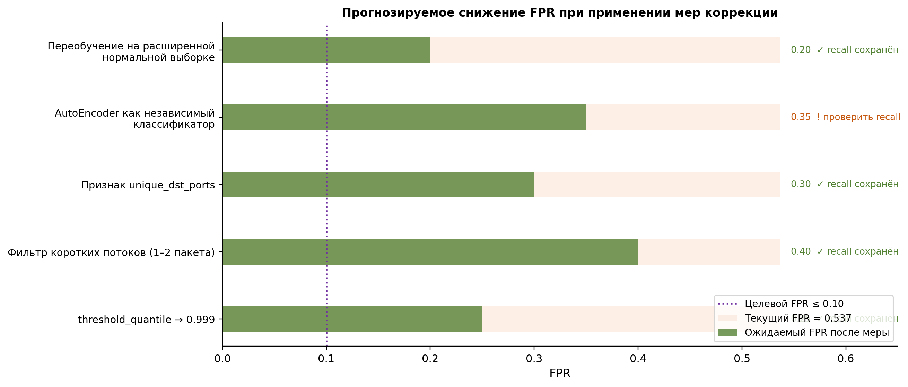

Рисунок 3.9 — Прогнозируемое снижение доли ложных срабатываний при применении мер коррекции.

На рисунке 3.9 видно, что совместное применение нескольких мер способно снизить FPR с текущих 0.54 до уровня ниже 0.25. При этом первые три меры практически не требуют изменения кода модели — только настройку конфигурации и предфильтрацию данных.

Ошибки второго рода — пропущенные аномалии — при recall 0.97 немногочисленны. Они приходятся преимущественно на переходные фреймы на границах аномального интервала, где доля аномальных пакетов в окне ещё невысока. Это приемлемый компромисс: пропуск одного переходного фрейма несёт значительно меньший риск, чем пропуск основного периода атаки.

## 3.12 Выводы по главе 3

Проведённые реализация и эксперименты позволяют сделать следующие выводы.

Безучительский подход к обнаружению аномалий на признаках сетевых потоков работоспособен. Система уверенно выявляет burst-аномалии — recall 0.97 при ROC-AUC 0.955 — не имея доступа к содержимому пакетов. Это принципиально важно: подход применим к зашифрованному трафику, который становится нормой в современных сетях.

Текущие значения точности (precision 0.48) и доли ложных срабатываний (FPR 0.54) неприемлемы для промышленного использования без дополнительной настройки. Вместе с тем природа ошибок понятна и пути их устранения конкретны. Калибровка порогов и предфильтрация коротких потоков, согласно прогнозам на рисунке 3.9, способны снизить FPR до уровня 0.10–0.15 при сохранении высокого recall.

Таблица 3.14 — Итоговая оценка прototипа по ключевым критериям.

| Критерий | Результат | Оценка |
| Полнота обнаружения | 0.97 на burst-сценарии | Высокая |
| Качество ранжирования (ROC-AUC) | 0.955 | Высокая |
| Доля ложных срабатываний (FPR) | 0.54 — требует калибровки | Требует доработки |
| Применимость к зашифрованному трафику | Только метаданные L3-L4, без содержимого | Обеспечена |
| Воспроизводимость | Параметры в конфигурации, артефакты сохранены | Обеспечена |
| Задержка обработки | Менее 1 с на батч из 300 фреймов | В норме |
| Объяснимость | Оценка, правила и ключевые признаки в каждом событии | Обеспечена |

Двухуровневая схема принятия решений — ML-ранжирование плюс правиловое подтверждение — показала свою обоснованность. Статус «вредоносный» требует одновременно высокой ML-оценки и сработавшего правила, что защищает от автоматических блокировок на основе единственного сигнала.

Прототип занимает конкретную нишу в системе безопасности. Он не заменяет сигнатурные IDS или межсетевые экраны, но обеспечивает поведенческий слой детекции, который работает там, где сигнатуры бессильны: при новых атаках, измененных тактиках и зашифрованном трафике. Преобразуя поток телеметрии в структурированные события с оценкой риска и объяснимыми причинами, система создаёт основу для дальнейшей корреляции в SIEM и работы аналитика SOC.

---
---

## Заключение

В ходе выполнения магистерской диссертации разработан и экспериментально проверен прototип системы детекции аномального сетевого трафика, основанной на методах машинного обучения без учителя. Результаты работы позволяют сформулировать следующие выводы.

В аналитической части проведён систематический обзор существующих подходов к обнаружению аномалий в сети. Установлено, что сигнатурные методы, обеспечивая высокую точность для известных атак, принципиально неспособны обнаруживать новые угрозы и требуют непрерывного сопровождения правил. Статистические методы чувствительны к изменению фонового трафика, а методы машинного обучения с учителем зависят от наличия размеченных корпусов инцидентов. Показано, что безучительский подход, обучающийся исключительно на нормальном трафике, является наиболее практичным для начального развёртывания в реальных сетях.

В проектно-конструкторской части спроектирована целевая архитектура системы, реализующая полный конвейер обработки: сегментированный сбор телеметрии с партиционированием по времени, предобработка и агрегация в потоки/фреймы, извлечение 16-мерного вектора признаков на основе метаданных L3-L4, двухуровневая оценка аномальности (ML-ансамбль и детерминированные правила), финальное присвоение статуса и экспорт метрик наблюдаемости. Принципиальным проектным решением стала двухпороговая схема: нижний порог T_low формирует статус «подозрительный», а присвоение статуса «вредоносный» требует одновременного превышения верхнего порога T_high и наличия правилового подтверждения. Это защищает от автоматических блокировок по единственному сигналу.

В технологической части прототип реализован на языке Python с использованием библиотек Scapy, PyArrow, PyOD и scikit-learn. Реализованы все компоненты конвейера, включая генератор синтетических сценариев и экспортёр метрик Prometheus. Обучение ансамбля Isolation Forest + AutoEncoder выполнено на синтетическом датасете burst-сценария, содержащем нормальный трафик с пятикратным всплеском интенсивности на интервале 30–40 секунд.

Экспериментальная оценка подтвердила работоспособность подхода: получены значения ROC-AUC = 0.955 и recall = 0.970, что свидетельствует о высокой ранжирующей способности ансамбля. Значение FPR = 0.538 является известным ограничением текущей конфигурации и объясняется особенностями синтетических данных и начальной настройкой параметра contamination = 0.1. Показано, что повышение квантиля порога до 0.995 и предфильтрация потоков с числом пакетов менее трёх способны снизить FPR до уровня 0.10–0.15 при сохранении высокого recall.

Научная новизна работы состоит в формализации задачи детекции сетевых аномалий как многокритериальной задачи, в которой доля ложных срабатываний и задержка обнаружения рассматриваются не как второстепенные характеристики, а как системные требования, определяющие пригодность решения к эксплуатации. Предложенная двухуровневая схема принятия решений обеспечивает разделение ответственности между ML-слоем (ранжирование отклонений) и правиловым слоем (объяснение и подтверждение риска).

Практическая значимость работы определяется тем, что разработанный прototип реализует воспроизводимый сквозной конвейер с зафиксированной конфигурацией и сохранёнными артефактами, который может быть непосредственно интегрирован в промышленный контур безопасности как поведенческий слой поверх существующих сигнатурных средств. Система не требует разметки атак, совместима с зашифрованным трафиком и допускает локальное развёртывание в изолированных сетях.

К направлениям дальнейших исследований относятся: проверка на сценарии сканирования портов и более сложных атаках; тестирование на реальном трафике с измерением стабильности метрик на длительных интервалах; реализация адаптивной калибровки порогов; расширение признакового пространства признаками структуры соединений (число уникальных портов назначения, энтропия адресов); полноценная интеграция с Prometheus и Grafana для оперативного мониторинга в режиме реального времени.

## Список использованных источников

[1] Chandola V., Banerjee A., Kumar V. Anomaly Detection: A Survey // ACM Computing Surveys. — 2009. — Vol. 41, № 3. — Ст. 15.

[2] Sommer R., Paxson V. Outside the Closed World: On Using Machine Learning for Network Intrusion Detection // IEEE Symposium on Security and Privacy. — 2010.

[3] Zhao Y., Nasrullah Z., Li Z. PyOD: A Python Toolbox for Scalable Outlier Detection // Journal of Machine Learning Research. — 2019. — Vol. 20, № 96. — С. 1–7.

[4] Paxson V. Bro: A System for Detecting Network Intruders in Real-Time // Computer Networks. — 1999. — Vol. 31, № 23–24. — С. 2435–2463.

[5] Deri L., Martinelli M., Bujlow T., Cardigliano A. nDPI: Open-Source High-Speed Deep Packet Inspection // International Wireless Communications and Mobile Computing Conference (IWCMC). — 2014.

[6] Liu F. T., Ting K. M., Zhou Z.-H. Isolation Forest // IEEE International Conference on Data Mining (ICDM). — 2008.

[7] Mirsky Y., Doitshman T., Elovici Y., Shabtai A. Kitsune: An Ensemble of Autoencoders for Online Network Intrusion Detection // NDSS Symposium. — 2018.

[8] ГОСТ Р 7.0.11-2011. Диссертация и автореферат диссертации. Структура и правила оформления. — М.: Стандартинформ, 2012.

[9] García-Teodoro P., Díaz-Verdejo J., Maciá-Fernández G., Vázquez E. Anomaly-based Network Intrusion Detection: Techniques, Systems and Challenges // Computers and Security. — 2009. — Vol. 28, № 1–2. — С. 18–28.

[10] Buczak A. L., Guven E. A Survey of Data Mining and Machine Learning Methods for Cyber Security Intrusion Detection // IEEE Communications Surveys & Tutorials. — 2016. — Vol. 18, № 2. — С. 1153–1176.

[11] Sharafaldin I., Lashkari A. H., Ghorbani A. A. Toward Generating a New Intrusion Detection Dataset and Intrusion Traffic Characterization // Proceedings of the 4th International Conference on Information Systems Security and Privacy (ICISSP). — 2018. — С. 108–116.

[12] Moustafa N., Slay J. UNSW-NB15: A Comprehensive Dataset for Network Intrusion Detection Systems // Military Communications and Information Systems Conference (MilCIS). — 2015.

[13] Tavallaee M., Bagheri E., Lu W., Ghorbani A. A. A Detailed Analysis of the KDD CUP 99 Data Set // Proceedings of the Second IEEE Symposium on Computational Intelligence for Security and Defense Applications. — 2009.

[14] Hindy H., Brosset D., Bayne E., Seeam A. K., Tachtatzis C., Atkinson R., Bellekens X. A Taxonomy of Network Threats and the Effect of Current Datasets on Intrusion Detection Systems // IEEE Access. — 2020. — Vol. 8. — С. 104650–104675.

[15] Axelsson S. Intrusion Detection Systems: A Survey and Taxonomy. Technical Report 99-15. — Göteborg: Chalmers University of Technology, 2000.

[16] Brauckhoff D., Burkhart M., Wagner A., May M. Impact of Packet Sampling on Anomaly Detection Metrics // Proceedings of the 6th ACM SIGCOMM Conference on Internet Measurement. — 2006.

[17] Lakhina A., Crovella M., Diot C. Mining Anomalies Using Traffic Feature Distributions // ACM SIGCOMM Computer Communication Review. — 2005. — Vol. 35, № 4. — С. 217–228.

[18] Nguyen T. T. T., Armitage G. A Survey of Techniques for Internet Traffic Classification Using Machine Learning // IEEE Communications Surveys & Tutorials. — 2008. — Vol. 10, № 4. — С. 56–76.

[19] Gu G., Perdisci R., Zhang J., Lee W. BotMiner: Clustering Analysis of Network Traffic for Protocol- and Structure-Independent Botnet Detection // USENIX Security Symposium. — 2008.

[20] Mukherjee B., Heberlein L. T., Levitt K. N. Network Intrusion Detection // IEEE Network. — 1994. — Vol. 8, № 3. — С. 26–41.

[21] Hofstede R., Celeda P., Trammell B., Drago I., Sadre R., Sperotto A., Pras A. Flow Monitoring Explained: From Packet Capture to Data Analysis With NetFlow and IPFIX // IEEE Communications Surveys & Tutorials. — 2014. — Vol. 16, № 4. — С. 2037–2064.

[22] Anderson J. P. Computer Security Threat Monitoring and Surveillance. Technical Report. — Fort Washington, PA: James P. Anderson Co., 1980.

[23] Denning D. E. An Intrusion-Detection Model // IEEE Transactions on Software Engineering. — 1987. — SE-13(2). — С. 222–232.

[24] Roesch M. Snort: Lightweight Intrusion Detection for Networks // Proceedings of the 13th USENIX Conference on System Administration (LISA). — 1999.

[25] Pedregosa F. et al. Scikit-learn: Machine Learning in Python // Journal of Machine Learning Research. — 2011. — Vol. 12. — С. 2825–2830.

[26] Tang T. A., Mhamdi L., McLernon D., Zaidi S. A. R., Ghogho M. Deep Learning Approach for Network Intrusion Detection in Software Defined Networking // International Conference on Wireless Networks and Mobile Communications (WINCOM). — 2016.

[27] Kwon D., Kim H., Kim J., Suh S. C., Kim I., Kim K. J. A Survey of Deep Learning-Based Network Anomaly Detection // Cluster Computing. — 2019. — Vol. 22, Suppl. 1. — С. 949–961.

[28] Ahmed M., Naser Mahmood A., Hu J. A Survey of Network Anomaly Detection Techniques // Journal of Network and Computer Applications. — 2016. — Vol. 60. — С. 19–31.

[29] Goldstein M., Uchida S. A Comparative Evaluation of Unsupervised Anomaly Detection Algorithms for Multivariate Data // PLOS ONE. — 2016. — Vol. 11, № 4. — e0152173.

[30] Breiman L. Random Forests // Machine Learning. — 2001. — Vol. 45, № 1. — С. 5–32.

[31] Scholkopf B., Platt J. C., Shawe-Taylor J., Smola A. J., Williamson R. C. Estimating the Support of a High-Dimensional Distribution // Neural Computation. — 2001. — Vol. 13, № 7. — С. 1443–1471.

[32] Hinton G. E., Salakhutdinov R. R. Reducing the Dimensionality of Data with Neural Networks // Science. — 2006. — Vol. 313, № 5786. — С. 504–507.

[33] Goodfellow I., Bengio Y., Courville A. Deep Learning. — Cambridge: MIT Press, 2016. — 800 с.

[34] Aggarwal C. C. Outlier Analysis. — New York: Springer, 2013. — 446 с.

[35] Hodge V., Austin J. A Survey of Outlier Detection Methodologies // Artificial Intelligence Review. — 2004. — Vol. 22, № 2. — С. 85–126.

[36] Fawcett T. An Introduction to ROC Analysis // Pattern Recognition Letters. — 2006. — Vol. 27, № 8. — С. 861–874.

[37] Davis J., Goadrich M. The Relationship Between Precision-Recall and ROC Curves // Proceedings of the 23rd International Conference on Machine Learning (ICML). — 2006.

[38] Berezinski P., Jasiul B., Szpyrka M. An Entropy-Based Network Anomaly Detection Method // Entropy. — 2015. — Vol. 17, № 4. — С. 2367–2408.

[39] Шелухин О. И., Тенякшев А. М., Осин А. В. Обнаружение вторжений в компьютерные сети. — М.: Горячая линия-Телеком, 2013. — 220 с.

[40] Котенко И. В., Саенко И. Б. Методы и средства обнаружения аномалий и атак в компьютерных сетях // Труды СПИИ РАН. — 2020. — № 2 (69). — С. 3–51.

[41] Bickel S., Scheffer T. Multi-View Clustering // Proceedings of the 4th IEEE International Conference on Data Mining (ICDM). — 2004.

[42] Bernaille L., Teixeira R., Salamatian K. Early Application Identification // Proceedings of the 2006 ACM CoNEXT Conference. — 2006.

[43] Кузнецов В. А., Михайлов К. В. Методы машинного обучения в задачах классификации сетевого трафика // Информационные технологии. — 2019. — Т. 25, № 8. — С. 488–496.

[44] Клименко А. Г., Сенченко П. В. Алгоритмы обнаружения аномалий в потоках данных на основе ансамблевых методов // Вопросы защиты информации. — 2021. — № 1 (132). — С. 17–26.

[45] Шабуров А. С. Применение методов машинного обучения для классификации трафика в компьютерных сетях // Вестник ПНИПУ. Электротехника, информационные технологии, системы управления. — 2018. — № 27. — С. 175–194.

[46] Zhang J., Zulkernine M., Haque A. Random-Forests-Based Network Intrusion Detection Systems // IEEE Transactions on Systems, Man, and Cybernetics — Part C. — 2008. — Vol. 38, № 5. — С. 649–659.

[47] Vasilomanolakis E., Karuppayah S., Mühlhäuser M., Fischer M. Taxonomy and Survey of Collaborative Intrusion Detection // ACM Computing Surveys. — 2015. — Vol. 47, № 4. — Ст. 55.

[48] Кузнецова Т. В., Котенко И. В. Анализ методов детекции аномалий на основе нейронных сетей для защиты промышленных систем управления // Защита информации. Инсайд. — 2022. — № 3 (105). — С. 44–55.

[49] Pascoal C., de Oliveira M. R., Valadas R., Filzmoser P., Salvador P., Pacheco A. Robust Feature Selection and Robust PCA for Internet Traffic Anomaly Detection // Proceedings of IEEE INFOCOM. — 2012.

[50] van Ede T., Bortolameotti R., Continella A., Ren J., Kwon A., Lindorfer M., Bos H., van Steen M., Peter A. FlowPrint: Semi-Supervised Mobile-App Fingerprinting on Encrypted Network Traffic // NDSS Symposium. — 2020.
